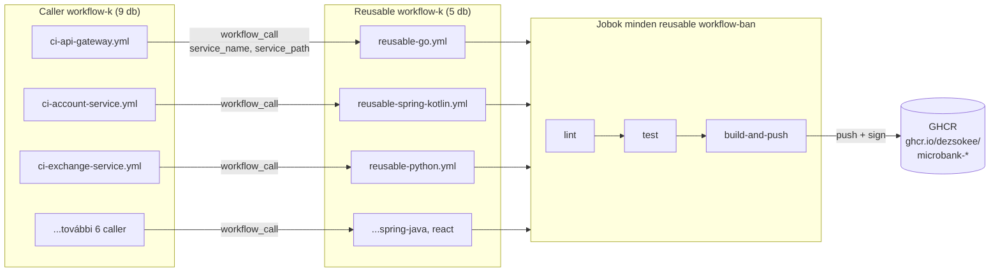
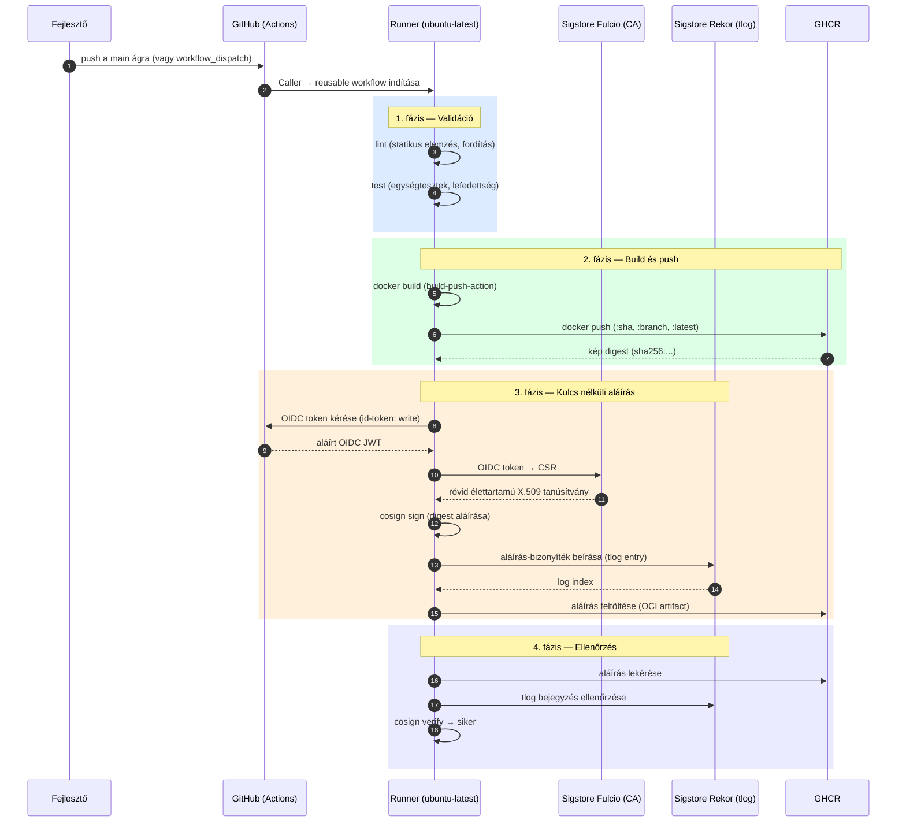

# CI/CD folyamat és Cosign aláírás
## Átfogó műszaki dokumentáció
*A MicroBank projekt folyamatos integrációs és szállítási (CI/CD) rendszere GitHub Actions és Sigstore Cosign segítségével*

---

## 1. Áttekintés

Ez a dokumentum a MicroBank projekt CI/CD (Continuous Integration / Continuous Delivery) folyamatát mutatja be, amely **GitHub Actions** platformon valósul meg. A folyamat minden szolgáltatás kódját automatikusan ellenőrzi (lint), teszteli, konténerképet épít belőle, feltölti a **GitHub Container Registry (GHCR)** tárolóba, majd **kulcs nélküli (keyless) Cosign aláírással** kriptográfiailag aláírja és ellenőrzi.

A pipeline két, egymásra épülő célt szolgál:

- **Folyamatos integráció** — minden kódmódosítás automatikus minőség-ellenőrzése (statikus elemzés, fordítás, tesztek), hogy a hibák a lehető legkorábban, már a pull request szintjén kiderüljenek.
- **Szoftver ellátási lánc biztonság (Software Supply Chain Security)** — minden kiadott konténerkép kriptográfiailag igazolható eredetet (provenance) kap, és manipulálhatatlanná (tamper-evident) válik. Ez a szakdolgozat egyik központi kutatási témája.

A rendszer kilenc mikroszolgáltatást fed le, öt különböző technológiai stack-en, és a YAML-duplikáció elkerülésére **újrafelhasználható workflow-k (reusable workflows)** mintáját alkalmazza.

---

## 2. Architekturális alapelvek

### 2.1 Caller és reusable workflow minta

A pipeline két réteg workflow-ból épül fel:

- **Reusable (újrafelhasználható) workflow** — stackenként egy fájl (összesen 5), amely a teljes `lint → test → build-and-push` logikát tartalmazza. Ezeket a `workflow_call` eseménnyel lehet meghívni, és `service_name`, valamint `service_path` bemeneti paramétereket fogadnak.
- **Caller (hívó) workflow** — szolgáltatásonként egy fájl (összesen 9), amely mindössze a megfelelő reusable workflow-t hívja meg, átadva a szolgáltatás nevét és útvonalát.

Ez a minta biztosítja, hogy az azonos technológiai stack-en futó szolgáltatások (például a három Go szolgáltatás) pontosan ugyanazt a logikát fussák, mindenféle másolás nélkül. Egy stack CI-logikájának módosítása egyetlen fájlban történik.

### 2.2 Monorepo és útvonal-szűrés

A projekt egyetlen Git repository-ban (monorepo) tárolja az összes szolgáltatást. Ahhoz, hogy egy adott szolgáltatás módosítása csak az érintett pipeline-t indítsa el, minden caller workflow **útvonal-szűrőt (`paths`)** alkalmaz: a workflow csak akkor fut le, ha a változás az adott szolgáltatás könyvtárát, a hozzá tartozó reusable workflow-t, vagy magát a caller fájlt érinti.

### 2.3 Fájlstruktúra

```
.github/workflows/
├── reusable-go.yml              # Go stack:    api-gateway, auth-service, fraud-service
├── reusable-spring-kotlin.yml   # Kotlin:      account-service, transaction-service
├── reusable-spring-java.yml     # Java:        audit-service
├── reusable-python.yml          # Python:      exchange-service, notification-service
├── reusable-react.yml           # React:       frontend
│
├── ci-api-gateway.yml           # ┐
├── ci-auth-service.yml          # │
├── ci-fraud-service.yml         # │
├── ci-account-service.yml       # │
├── ci-transaction-service.yml   # ├─ 9 caller workflow (szolgáltatásonként egy)
├── ci-audit-service.yml         # │
├── ci-exchange-service.yml      # │
├── ci-notification-service.yml  # │
└── ci-frontend.yml              # ┘
```

### 2.4 Szolgáltatás–workflow hozzárendelés

| Szolgáltatás | Caller workflow | Reusable workflow | Stack |
|---|---|---|---|
| api-gateway | `ci-api-gateway.yml` | `reusable-go.yml` | Go 1.22 |
| auth-service | `ci-auth-service.yml` | `reusable-go.yml` | Go 1.22 |
| fraud-service | `ci-fraud-service.yml` | `reusable-go.yml` | Go 1.22 |
| account-service | `ci-account-service.yml` | `reusable-spring-kotlin.yml` | Kotlin / Spring Boot 21 |
| transaction-service | `ci-transaction-service.yml` | `reusable-spring-kotlin.yml` | Kotlin / Spring Boot 21 |
| audit-service | `ci-audit-service.yml` | `reusable-spring-java.yml` | Java / Spring Boot 21 |
| exchange-service | `ci-exchange-service.yml` | `reusable-python.yml` | Python 3.12 |
| notification-service | `ci-notification-service.yml` | `reusable-python.yml` | Python 3.12 |
| frontend | `ci-frontend.yml` | `reusable-react.yml` | React / Node 20 |

### 2.5 A pipeline szerkezete — áttekintő diagram



---

## 3. Triggerek és a háromrétegű futási modell

### 3.1 Eseménytípusok

Minden caller workflow három eseményre indulhat:

- **`push` a `main` ágra** — a kanonikus kiadási (release) esemény. A kód már bekerült a fő ágba.
- **`pull_request`** — minden megnyitott vagy frissített PR validációja.
- **`workflow_dispatch`** — kézi indítás bármely ágról, az Actions felületről vagy a `gh workflow run` paranccsal.

Mindhárom eseményt útvonal-szűrő (`paths`) korlátozza (a `workflow_dispatch` kivételével, amely manuális).

### 3.2 A háromrétegű modell

A pipeline szándékosan elválasztja a *validációt* (olcsó, minden változásnál) az *artifact-gyártástól* (csak ami a `main`-be kerül, vagy amit kézzel kérünk). Ennek lényege, hogy **csak valóban bemergelt vagy szándékosan tesztelt képek kapnak aláírást** — így a nyilvános Rekor átláthatósági napló minden bejegyzése egy valódi kiadáshoz tartozik.

| Esemény | Lint + Test | `docker build` | Push GHCR-be | Cosign sign + verify |
|---|:---:|:---:|:---:|:---:|
| **`pull_request`** | ✅ | ✅ (validál) | ❌ | ❌ |
| **`workflow_dispatch`** (bármely ág) | ✅ | ✅ | ✅ | ✅ |
| **`push` → `main`** | ✅ | ✅ | ✅ (+`:latest`) | ✅ |

A `build-and-push` jobban ezt egyetlen feltétel vezérli, amelyet a kép feltöltésére és az aláíró/ellenőrző lépésekre egyaránt alkalmazunk:

```yaml
(github.event_name == 'push' && github.ref == 'refs/heads/main') || github.event_name == 'workflow_dispatch'
```

Pull request esetén tehát a kép felépül (a Dockerfile helyessége ellenőrzött), de **nem kerül feltöltésre és nem kerül aláírásra** — így sem a GHCR, sem a Rekor napló nem szennyeződik be be nem mergelt kódhoz tartozó artifactokkal.

### 3.3 Egyidejűség-kezelés (concurrency)

Minden caller workflow egy `concurrency` csoportot definiál, amely a workflow és a Git-referencia kombinációjára épül:

```yaml
concurrency:
  group: ${{ github.workflow }}-${{ github.ref }}
  cancel-in-progress: ${{ github.ref != 'refs/heads/main' }}
```

Ez automatikusan megszakítja egy ág korábbi, még futó pipeline-ját, ha újabb commit érkezik — kivéve a `main` ágat, ahol a kiadási futás mindig befejeződhet. Ez időt és erőforrást takarít meg, és kiküszöböli a versenyhelyzeteket.

---

## 4. Jogosultságok (permissions) és OIDC

A kulcs nélküli aláírás kulcskérdése a megfelelő jogosultságkiosztás. A `build-and-push` job az alábbi három jogosultságot igényli:

| Jogosultság | Cél |
|---|---|
| `contents: read` | A forráskód kicsekkolása (`actions/checkout`). |
| `packages: write` | A konténerkép feltöltése a GHCR-be. |
| `id-token: write` | **OIDC token kérése** a kulcs nélküli aláíráshoz. |

### 4.1 A reusable workflow downscope-szabálya

A GitHub Actionsben a reusable workflow a hívótól örökölt `GITHUB_TOKEN` jogosultságait **csak csökkenteni tudja, emelni nem**. Ezért az `id-token: write` jogosultságot a **caller workflow-ban is** explicit meg kell adni — pusztán a reusable workflow-ban deklarálva nem elegendő. Emiatt mind a 9 caller workflow tartalmaz egy felső szintű jogosultság-blokkot:

```yaml
permissions:
  contents: read
  packages: write
  id-token: write
```

Az `id-token` jogosultság sosem alapértelmezett: még a „Read and write” repository-beállítás mellett is mindig kifejezetten igényelni kell.

---

## 5. A jobok: lint → test → build-and-push

Minden reusable workflow három, egymásra épülő jobból áll (`needs` függőséggel láncolva): ha a `lint` elbukik, a `test` el sem indul; ha a `test` elbukik, a `build-and-push` el sem indul. Minden job `ubuntu-latest` futtatón fut.

### 5.1 Lint — statikus elemzés és fordítás

| Stack | Eszközök / parancsok |
|---|---|
| **Go 1.22** | `go mod tidy`, majd `golangci-lint` (golangci-lint-action@v6, legfrissebb verzió) |
| **Kotlin / Spring 21** | `gradle ktlintCheck`, majd `gradle compileKotlin` (Temurin JDK 21, Gradle 8.7) |
| **Java / Spring 21** | `gradle checkstyleMain checkstyleTest`, majd `gradle compileJava` |
| **Python 3.12** | `ruff check .` (linter), majd `ruff format --check .` (formázás-ellenőrzés) |
| **React / Node 20** | `npm install`, majd `npx tsc --noEmit` (TypeScript típusellenőrzés) |

### 5.2 Test — automatizált tesztek

| Stack | Tesztparancs | Adatbázis-szolgáltatás | Lefedettség |
|---|---|---|---|
| **Go** | `go test -v -race -coverprofile=coverage.out ./...` | — | `coverage.out` artifact |
| **Kotlin / Spring** | `gradle test` | `postgres:16` (sidecar service) | `build/reports/tests/` artifact |
| **Java / Spring** | `gradle test` | `postgres:16` (sidecar service) | `build/reports/tests/` artifact |
| **Python** | `pytest -v --cov=. --cov-report=xml` | — | `coverage.xml` artifact |
| **React** | `npm run build` (a build maga a teszt) | — | — |

A Spring Boot szolgáltatások tesztjei valódi PostgreSQL adatbázist igényelnek. Ezt a GitHub Actions **service container** mechanizmusa biztosítja: a runner egy `postgres:16` konténert indít (`test` / `test` / `testdb` hitelesítéssel), `pg_isready` healthcheck-kel, és a tesztek a `SPRING_DATASOURCE_*` környezeti változókon keresztül kapcsolódnak hozzá a `localhost:5432` címen.

A Python tesztparancs a `|| test $? -eq 5` kiegészítéssel toleranciát ad arra az esetre, ha a `pytest` nem talál tesztet (5-ös kilépési kód) — ilyenkor a job nem bukik el.

### 5.3 Build & Push — konténerkép építés és feltöltés

A `build-and-push` job mind az 5 reusable workflow-ban azonos. Lépései sorrendben:

1. **`actions/checkout@v4`** — a forráskód kicsekkolása.
2. **`docker/login-action@v3`** — bejelentkezés a GHCR-be a `github.actor` felhasználóval és a `GITHUB_TOKEN`-nel.
3. **Image tag-ek kiszámítása** (`id: tags`) — lásd a [6. fejezetet](#6-kép-elnevezési-és-címkézési-séma).
4. **`sigstore/cosign-installer@v3`** — a Cosign telepítése.
5. **`docker/build-push-action@v5`** (`id: build`) — a kép felépítése; feltöltés csak release/dispatch esetén; a lépés natívan visszaadja a kép SHA256 **digestjét** (`steps.build.outputs.digest`).
6. **Cosign sign** — a kép aláírása digest szerint (csak release/dispatch esetén).
7. **Cosign verify** — az aláírás azonnali ellenőrzése (csak release/dispatch esetén).

---

## 6. Kép elnevezési és címkézési séma

A konténerképek a következő minta szerint épülnek fel:

```
ghcr.io/dezsokee/microbank-<szolgáltatás-neve>
```

Az „Image tag-ek kiszámítása” lépés minden futáskor összeállítja a címkéket:

| Címke | Mikor | Cél |
|---|---|---|
| `:<git-sha>` | mindig | Pontos, visszakereshető verzió a teljes commit-hash alapján. |
| `:branch-<ág-neve>` | mindig | Ág-szintű, mutábilis címke (az ágnév megtisztítva: `/` és `_` → `-`). |
| `:latest` | **csak `main`-en** | A legutóbbi stabil kiadás. Feature ágon **soha** nem íródik felül. |

Ez a séma garantálja, hogy egy feature ágon vagy kézi futtatáskor készült teszt-kép `:branch-...` / `:<sha>` címkét kap, és **nem érinti a production `:latest` címkét**.

---

## 7. Cosign kulcs nélküli (keyless) aláírás

### 7.1 Az aláírás működése

A folyamat a **Sigstore** ökoszisztémára épül, és nem igényel privát kulcs tárolását:

1. A `cosign sign` lekéri a GitHub Actions **OIDC tokenjét** (ehhez kell az `id-token: write`).
2. Ezt a tokent elküldi a Sigstore **Fulcio** hitelesítő hatóságnak, amely cserébe egy rövid élettartamú (~10 perc) X.509 tanúsítványt állít ki, amelybe beágyazza a futtatás identitását.
3. Ezzel az ideiglenes tanúsítvánnyal aláírja a kép **digestjét**, és az aláírás bizonyítékát beírja a **Rekor** nyilvános átláthatósági (transparency) naplóba.
4. Az aláírás OCI-artifactként a GHCR-be kerül, a kép mellé.

### 7.2 Aláírás digest szerint

Az aláírás **mindig a kép megváltoztathatatlan SHA256 digestjére** vonatkozik, soha nem a mutábilis `:latest` vagy `:<sha>` címkére:

```
ghcr.io/dezsokee/microbank-<szolgáltatás>@sha256:<hash>
```

Ez ellátási lánc biztonsági szempontból kritikus: a digest tartalom-alapú és immutábilis, míg egy címke később átmutathat egy másik képre. A digestet a `docker/build-push-action@v5` natívan szolgáltatja, így nincs szükség `docker inspect`-re vagy a kimenet manuális elemzésére.

### 7.3 Az aláíró identitás — fontos részlet

Mivel az aláírás a **reusable** workflow-n belül történik, a Fulcio-tanúsítvány identitása (a Subject Alternative Name) a reusable workflow elérési útja, **nem** a hívó workflow-é. Például:

```
https://github.com/dezsokee/microbank/.github/workflows/reusable-spring-kotlin.yml@refs/heads/main
```

Ezért az ellenőrzéskor a tágabb, repository-szintű regexp illeszkedik függetlenül attól, melyik reusable fájl az aláíró.

### 7.4 Az ellenőrzés (verify)

A pipeline minden aláírás után azonnal ellenőriz is, ezzel végponttól végpontig bizonyítva, hogy az aláírás érvényes és bekerült a Rekor naplóba:

```bash
cosign verify \
  --certificate-identity-regexp="^https://github.com/dezsokee/microbank/.*" \
  --certificate-oidc-issuer="https://token.actions.githubusercontent.com" \
  ghcr.io/dezsokee/microbank-<szolgáltatás>@sha256:<hash>
```

A sikeres ellenőrzés három dolgot igazol: az aláírás érvényes (a tanúsítványt megbízható CA állította ki), a bejegyzés létezik a transparency logban, és a kép nem módosult az aláírás óta.

### 7.5 A kiadási és aláírási folyamat — szekvenciadiagram



---

## 8. Tesztelés merge előtt — a workflow_dispatch szerep

Mivel pull request esetén a pipeline csak validál (nem tölt fel és nem ír alá), a teljes lánc merge előtti kipróbálására a **`workflow_dispatch`** kézi trigger szolgál. A fejlesztő igény szerint, bármely ágról elindíthatja a teljes folyamatot:

```bash
gh workflow run ci-account-service.yml --ref feature/<ág-neve>
```

Ekkor a teljes lánc lefut (build → push → sign → verify) a feature ágon: a kép `:branch-...` / `:<sha>` címkét kap (a `:latest` érintetlen marad), a beépített verify lépés pedig bizonyítja, hogy az aláírás működik — anélkül, hogy a kódot a `main`-be kellene mergelni.

---

## 9. Biztonsági előnyök

A CI/CD pipeline az alábbi ellátási lánc biztonsági tulajdonságokat valósítja meg:

- **Igazolható eredet (provenance):** minden kiadott kép kriptográfiailag bizonyítja, hogy a `dezsokee/microbank` repository egy GitHub Actions workflow-ja építette.
- **Manipulálhatatlanság (tamper-evidence):** az aláírás a kép digestjére vonatkozik, így a kép utólagos módosítása az ellenőrzés bukásával lelepleződik.
- **Privát kulcs nélküli működés:** nincs tárolandó vagy rotálandó aláírókulcs; az identitás az efemer OIDC token.
- **Nyilvános auditálhatóság:** minden aláírás bekerül a Rekor publikus átláthatósági naplóba, ahol bárki visszakereshető és ellenőrizhető.
- **Tiszta release-szemantika:** csak a `main`-be mergelt (vagy szándékosan dispatch-elt) képek kapnak aláírást, így minden Rekor-bejegyzés valódi kiadáshoz tartozik.
- **Korai hibadetektálás:** a lint és teszt minden PR-en lefut, az artifact-gyártás előtt.

---

## 10. A CI/CD mentális modellje

A MicroBank CI/CD rendszere négy egymást kiegészítő elven nyugszik:

- **Reusable workflow-k:** egyetlen helyen definiált, stackenkénti CI-logika — *ne ismételd magad*.
- **Háromrétegű trigger:** PR-en validálj, `main`-en és kézi indításra adj ki és írj alá — *csak a valódi artifactot írd alá*.
- **OIDC + Cosign keyless:** privát kulcs nélküli, identitás-alapú aláírás — *ki építette ezt a képet?*
- **Digest szerinti aláírás + Rekor:** immutábilis, nyilvánosan auditálható bizonyíték — *bizonyítsd, hogy nem változott*.

Együttesen egy olyan szállítási láncot alkotnak, amelyben minden kiadott konténerkép automatikusan ellenőrzött minőségű, igazolható eredetű és manipulálhatatlan — a Software Supply Chain Security gyakorlati megvalósítása egy heterogén mikroszolgáltatás-architektúrában.
