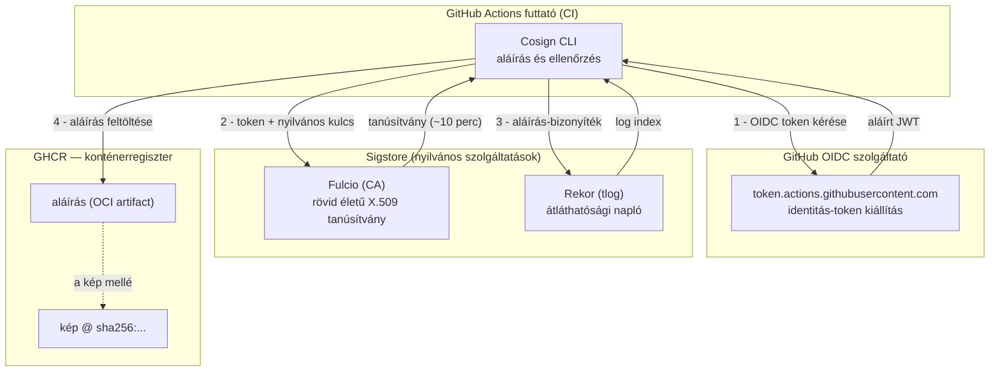
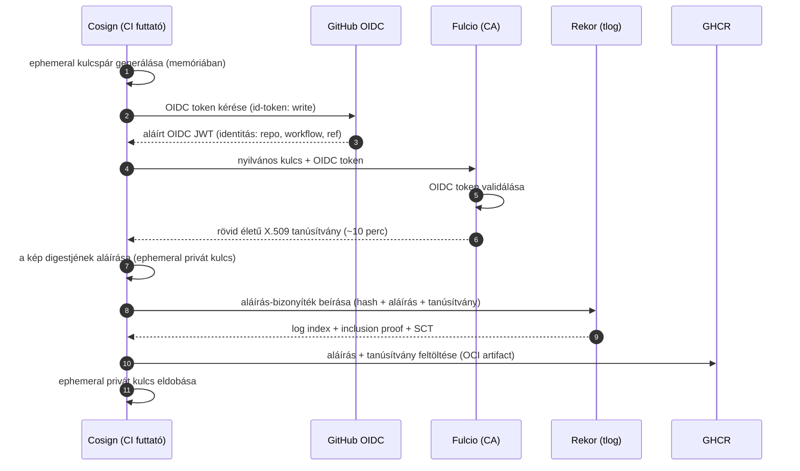
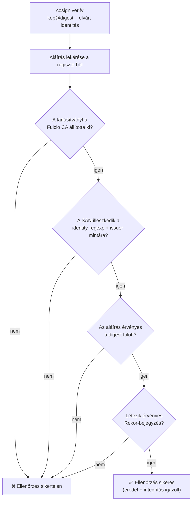
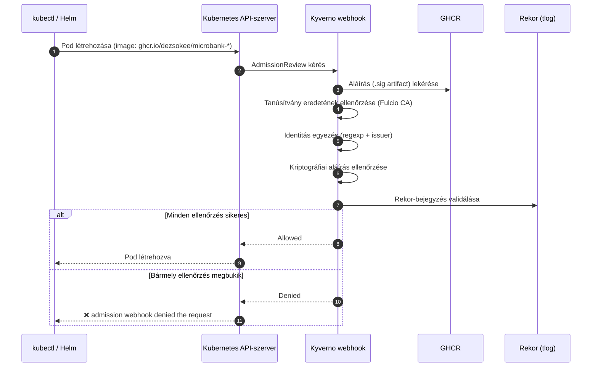
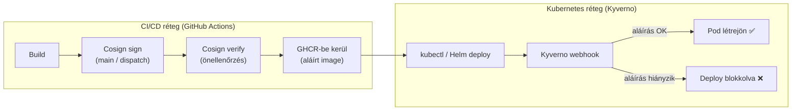

# Cosign kulcs nélküli (keyless) konténeraláírás
## Átfogó műszaki dokumentáció
*Konténerképek kriptográfiai aláírása és ellenőrzése a Sigstore ökoszisztémával, GitHub Actions OIDC identitás alapján*

---

## 1. Áttekintés

Ez a dokumentum részletesen bemutatja, hogyan működik a **Cosign kulcs nélküli (keyless) aláírás** a MicroBank projekt CI/CD folyamatában. A cél a **szoftver ellátási lánc biztonság (Software Supply Chain Security)** egy konkrét kontrolljának megvalósítása: minden kiadott konténerkép kriptográfiailag igazolható eredetet (provenance) kap, és manipulálhatatlanná (tamper-evident) válik.

Az alapkérdés, amelyre a folyamat választ ad:

> *Honnan tudom, hogy egy konténerregisztriben tárolt kép valóban abból a forrásból származik, ahonnan állítja, és nem módosították-e a felépítése óta?*

Hagyományosan ezt aláírókulccsal oldanák meg — de a privát kulcsok tárolása, rotálása és védelme önmagában is komoly kockázat. A Cosign **keyless** módja ezt a problémát szünteti meg: **nincs tárolandó privát kulcs**, az aláíró identitását egy rövid életű OIDC token igazolja, a bizonyíték pedig egy nyilvános átláthatósági naplóba kerül.

> Ez a dokumentum az aláírás kriptográfiai és Sigstore-mechanizmusára fókuszál. A CI/CD folyamatba való beágyazás (triggerek, jogosultságok, jobok) részleteit a [CI-CD_documentation.md](CI-CD_documentation.md) tárgyalja.

---

## 2. A Sigstore ökoszisztéma

A Cosign a **Sigstore** nyílt forráskódú projekt része, amelyet a Linux Foundation gondoz. A keyless aláírás négy komponens összjátékára épül:

| Komponens | Szerep |
|---|---|
| **Cosign** | A parancssori eszköz, amely az aláírást és az ellenőrzést végzi. |
| **Fulcio** | Rövid élettartamú tanúsítványokat kiállító hitelesítő hatóság (CA). |
| **Rekor** | Nyilvános, megváltoztathatatlan átláthatósági (transparency) napló az aláírások bizonyítékához. |
| **OIDC szolgáltató** | Az identitás forrása. A CI-ban ez a **GitHub Actions OIDC** szolgáltató (`token.actions.githubusercontent.com`). |

Emellett a Cosign a **TUF (The Update Framework)** segítségével biztonságosan szerzi be a Fulcio és Rekor megbízható gyökérkulcsait, így az ellenőrzés nem támaszkodik egyetlen hardkódolt tanúsítványra sem.

### 2.1 Az ökoszisztéma — komponens diagram



---

## 3. Miért „kulcs nélküli"?

A hagyományos (kulcsalapú) aláírásnál egy hosszú élettartamú privát kulcs aláírja az artifactot, és a megfelelő nyilvános kulccsal bárki ellenőrizheti. A nehézség nem a kriptográfia, hanem a **kulcskezelés**: hol tároljuk biztonságosan a privát kulcsot, hogyan rotáljuk, mi történik, ha kiszivárog?

A keyless megközelítés ezt másképp oldja meg:

- Az aláíráshoz a Cosign **menet közben (memóriában) generál egy egyszer használatos (ephemeral) kulcspárt**.
- A kulcs identitását nem egy előre megosztott bizalom igazolja, hanem egy **OIDC token** — vagyis a futtató környezet hitelesített identitása (jelen esetben a GitHub Actions workflow).
- Az aláírás után az **ephemeral privát kulcsot eldobjuk**. Nincs mit tárolni, nincs mit ellopni.
- A bizalom forrása a **nyilvános transparency log**: bárki utólag ellenőrizheti, hogy az aláírás létrejött, ki készítette és mikor.

Lényegében a „kulcs" szerepét az **identitás + idő** veszi át: *ez az identitás írta alá ezt a digestet, ekkor, és ez a Rekor naplóban bizonyítható.*

---

## 4. Az aláírási folyamat lépésről lépésre

Amikor a CI lefuttatja a `cosign sign --yes <kép>@sha256:<hash>` parancsot, a következő történik:

1. **Ephemeral kulcspár generálása** — a Cosign a memóriában létrehoz egy egyszer használatos privát/nyilvános kulcspárt.
2. **OIDC token kérése** — a Cosign lekéri a GitHub Actions OIDC tokenjét. Ehhez a workflow-nak `id-token: write` jogosultsággal kell rendelkeznie. A token igazoltan tartalmazza, hogy *melyik repository, melyik workflow-fájl, melyik ág/commit és milyen esemény* fut.
3. **Tanúsítvány igénylése a Fulciótól** — a Cosign elküldi az ephemeral nyilvános kulcsot és az OIDC tokent a Fulciónak. A Fulcio ellenőrzi a token érvényességét, majd kiállít egy **rövid élettartamú (~10 perces) X.509 tanúsítványt**, amely összeköti az ephemeral nyilvános kulcsot a token identitásával (a Subject Alternative Name mezőben).
4. **A digest aláírása** — a Cosign az ephemeral privát kulccsal aláírja a kép **SHA256 digestjét**.
5. **Bejegyzés a Rekorba** — a Cosign feltölti az aláírás bizonyítékát (a digest hash-ét, az aláírást és a tanúsítványt) a Rekor átláthatósági naplóba, amely visszaad egy **log indexet** és egy beágyazási (inclusion) bizonyítékot.
6. **Az aláírás feltöltése a regiszterbe** — a Cosign az aláírást és a tanúsítványt **OCI-artifactként** a GHCR-be tölti, a kép mellé (lásd a [8. fejezetet](#8-az-aláírás-tárolása-a-regiszterben)).
7. **A privát kulcs eldobása** — az ephemeral privát kulcs megsemmisül.

### 4.1 Az aláírási folyamat — szekvenciadiagram



---

## 5. Miért a digest szerinti aláírás?

Az aláírás **mindig a kép megváltoztathatatlan SHA256 digestjére** vonatkozik, soha nem a mutábilis címkére (`:latest`, `:<sha>`):

```
ghcr.io/dezsokee/microbank-account-service@sha256:4bc3333f...
```

A különbség kritikus:

- A **digest** a kép tartalmából számított hash. Ha a kép egyetlen bájtja megváltozik, a digest is más lesz. A digest tehát egy adott, pontos képtartalmat azonosít, megmásíthatatlanul.
- A **címke** (tag) ezzel szemben csak egy mutató: a `:latest` ma az egyik képre, holnap egy másikra mutathat. Egy címkére adott aláírás ezért nem bizonyítja, hogy a kép tartalma nem változott.

A digest szerinti aláírással az aláírás kriptográfiailag a *pontos képtartalomhoz* kötődik — ez az ellátási lánc biztonság alapfeltétele. A MicroBank pipeline-jában a digestet a `docker/build-push-action@v5` natívan szolgáltatja (a lépés `digest` kimenete), így nincs szükség a feltöltési kimenet manuális elemzésére.

---

## 6. A Fulcio-tanúsítvány tartalma

A Fulcio által kiállított tanúsítvány a kulcs nélküli modell „identitás-bizonyítványa". Legfontosabb tulajdonságai:

- **Rövid élettartam (~10 perc):** a tanúsítvány csak az aláírás idejére érvényes, utána lejár. Ez azt jelenti, hogy egy ellopott tanúsítvánnyal nem lehet később visszaélni.
- **Subject Alternative Name (SAN) — az aláíró identitása:** ide kerül a futtató környezet azonosítója, például:
  ```
  https://github.com/dezsokee/microbank/.github/workflows/reusable-spring-kotlin.yml@refs/heads/main
  ```
- **OIDC kibocsátó (issuer):** a tanúsítvány X.509 kiterjesztései rögzítik, hogy az identitás a `https://token.actions.githubusercontent.com` szolgáltatótól származik, valamint olyan részleteket, mint a workflow neve, a kiváltó esemény (`push`, `pull_request`, `workflow_dispatch`), a commit SHA-ja és a Git-referencia.

### 6.1 Fontos részlet — a reusable workflow identitása

Mivel a MicroBank-ban az aláírás a **reusable** workflow-n belül történik, a tanúsítvány SAN mezője a **reusable workflow elérési útja**, **nem** a hívó (caller) workflow-é. Ezért az ellenőrzéskor a tágabb, repository-szintű regexp illeszkedik, függetlenül attól, melyik reusable fájl az aláíró:

```
--certificate-identity-regexp="^https://github.com/dezsokee/microbank/.*"
```

Ha a regexp szűkebben csak egy caller fájlra illeszkedne, az ellenőrzés tévesen elbukna — pedig az aláírás teljesen érvényes.

---

## 7. A Rekor átláthatósági napló

A **Rekor** egy nyilvános, csak hozzáfűzhető (append-only), megváltoztathatatlan napló, amely minden aláírásról bizonyítékot tárol. Szerepe a keyless modellben kulcsfontosságú:

- **Időbélyeg a rövid életű tanúsítványhoz:** mivel a Fulcio-tanúsítvány ~10 perc múlva lejár, az ellenőrzéskor már rég nem érvényes. A Rekor-bejegyzés **integrált időbélyege** bizonyítja, hogy az aláírás *akkor* készült, *amikor* a tanúsítvány még érvényes volt. Idő nélkül nem lehetne megkülönböztetni egy érvényes régi aláírást egy lejárt tanúsítvánnyal készült hamisítványtól.
- **Nyilvános auditálhatóság:** bárki lekérdezheti a naplót, és ellenőrizheti, hogy egy adott digestet ki és mikor írt alá. Egy támadó nem tudna észrevétlenül aláírni: a bejegyzés nyilvánosan látható lenne.
- **Offline ellenőrizhetőség:** a bejegyzéshez tartozó **inclusion proof** (beágyazási bizonyíték) alapján az ellenőrzés a Rekor folyamatos elérése nélkül is igazolható.

Az aláíráskor a Cosign egy **log indexet** kap (például `1809073384`), amely a konkrét bejegyzésre mutat, és egy **SCT-t (Signed Certificate Timestamp)**, amely a Fulcio Certificate Transparency naplójából igazolja a tanúsítvány kiállítását.

---

## 8. Az aláírás tárolása a regiszterben

A GHCR natívan támogatja az OCI-artifactokat, ezért az aláírás **ugyanabban a regiszterben, a kép mellé** kerül — nincs szükség külön infrastruktúrára. A Cosign az aláírást egy származtatott címke alatt tárolja, amely a kép digestjéből képződik:

```
sha256-<a kép digestje>.sig
```

Így a `ghcr.io/dezsokee/microbank-account-service@sha256:4bc3...` képhez tartozó aláírás egy `sha256-4bc3....sig` címkéjű manifest lesz ugyanabban a repository-ban. Ez a manifest tartalmazza az aláírást és a Fulcio-tanúsítványt (a Rekor-bizonyítékkal együtt), amelyeket az ellenőrzés visszaolvas.

---

## 9. Az ellenőrzés (verify) folyamata

Az ellenőrzés a `cosign verify` paranccsal történik. A MicroBank pipeline-jában ez **automatikusan, közvetlenül az aláírás után** is lefut, így a CI végponttól végpontig bizonyítja, hogy az aláírás érvényes:

```bash
cosign verify \
  --certificate-identity-regexp="^https://github.com/dezsokee/microbank/.*" \
  --certificate-oidc-issuer="https://token.actions.githubusercontent.com" \
  ghcr.io/dezsokee/microbank-account-service@sha256:4bc3333f...
```

Az ellenőrzés a következő lépéseket végzi el:

1. **Az aláírás lekérése** a regiszterből (a `.sig` artifact).
2. **A tanúsítvány eredetének ellenőrzése:** a tanúsítványt a megbízható Fulcio CA állította-e ki (a TUF-on keresztül beszerzett gyökérkulcsok alapján).
3. **Az identitás egyezésének ellenőrzése:** a tanúsítvány SAN-ja illeszkedik-e a `--certificate-identity-regexp` mintára, és a kibocsátó megegyezik-e a `--certificate-oidc-issuer` értékkel. **Ez a két paraméter a védelem lényege:** nem elég bármilyen érvényes aláírás — kifejezetten a *mi* repository-nk GitHub Actions workflow-jának kell aláírnia.
4. **Az aláírás kriptográfiai ellenőrzése:** a tanúsítvány nyilvános kulcsával a digest fölötti aláírás helyes-e.
5. **A Rekor-bejegyzés ellenőrzése:** létezik-e a transparency log bejegyzés, és az integrált időbélyeg a tanúsítvány érvényességi idejére esik-e.

Ha mind az öt ellenőrzés sikeres, a parancs kiírja a tanúsítvány-állításokat (claims) tartalmazó JSON-t. Ha bármelyik megbukik, a parancs hibával (nem-nulla kilépési kóddal) leáll.

### 9.1 Az ellenőrzés kimenetének értelmezése

A sikeres `cosign verify` három elvégzett ellenőrzést sorol fel, majd a tanúsítvány állításait adja vissza. A legfontosabb mezők:

| Mező | Jelentés |
|---|---|
| `Issuer` | Az OIDC kibocsátó — `https://token.actions.githubusercontent.com`. |
| `Subject` | Az aláíró identitása — a reusable workflow elérési útja + Git-referencia. |
| `docker-manifest-digest` | A pontos digest, amelyre az aláírás vonatkozik. |
| `githubWorkflowTrigger` | A kiváltó esemény (pl. `push`, `workflow_dispatch`). |
| `githubWorkflowSha` | Az a commit, amelyből a kép épült. |
| `logIndex` | A Rekor transparency log bejegyzés azonosítója (nyilvánosan visszakereshető). |

### 9.2 Az ellenőrzés — folyamatábra



---

## 10. Beágyazás a MicroBank pipeline-ba

A keyless aláírás a `build-and-push` job része, mind az 5 reusable workflow-ban azonos módon:

- A Cosignt a **`sigstore/cosign-installer@v3`** action telepíti.
- Az aláírás és az ellenőrzés **csak release vagy kézi futtatás esetén** fut le (`push` a `main`-re, vagy `workflow_dispatch`). Pull requesten a kép felépül, de nem kerül feltöltésre és nem kerül aláírásra — így a nyilvános Rekor napló nem szennyeződik be be nem mergelt kódhoz tartozó aláírásokkal.
- Az aláíráshoz szükséges `id-token: write` jogosultságot a **caller workflow-ban is** explicit meg kell adni, mert a reusable workflow a tokent csak csökkenteni tudja, emelni nem.

A részletekért lásd a [CI-CD_documentation.md](CI-CD_documentation.md) dokumentumot.

> **Megjegyzés a `COSIGN_EXPERIMENTAL`-ról:** a régebbi útmutatók egy `COSIGN_EXPERIMENTAL=1` környezeti változót írtak elő a keyless aláíráshoz. A Cosign v2-ben (amelyet a `cosign-installer@v3` telepít) a keyless aláírás már általánosan elérhető (GA), így ez a változó elavult és felesleges — a MicroBank pipeline nem használja.

---

## 11. Biztonsági előnyök és fenyegetésmodell

A keyless aláírás az alábbi támadások ellen véd:

- **Kép-manipuláció (image tampering):** ha valaki módosítja a képet a feltöltés után, a digest megváltozik, és az aláírás-ellenőrzés megbukik.
- **Regiszter-kompromittálódás:** még ha egy támadó hozzá is fér a GHCR-hez, nem tud érvényes aláírást hamisítani, mert ahhoz a *mi* GitHub Actions identitásunkból kiállított Fulcio-tanúsítvány kellene — ezt pedig csak a valódi workflow OIDC tokenjével lehet megszerezni.
- **Eredet meghamisítása (provenance spoofing):** az `--certificate-identity-regexp` és `--certificate-oidc-issuer` paraméterek biztosítják, hogy csak a megadott repository workflow-jának aláírását fogadjuk el — egy idegen, de technikailag érvényes aláírás elutasításra kerül.
- **Privát kulcs kiszivárgása:** nincs hosszú élettartamú kulcs, amit el lehetne lopni; az ephemeral kulcs az aláírás után megsemmisül.
- **Csendes (észrevétlen) aláírás:** minden aláírás a nyilvános Rekor naplóba kerül, így utólag auditálható, és egy jogosulatlan aláírás nyoma sem maradhatna rejtve.

---

## 12. Kyverno — aláírás-ellenőrzés kikényszerítése Kubernetes-ben

A Cosign aláírás önmagában csak a *lehetőséget* teremti meg az ellenőrzésre. Ahhoz, hogy a Kubernetes-cluster ne fogadjon be aláíratlan képet, egy **admission controller** szükséges, amely minden Pod-létrehozási kérelemnél elvégzi az ellenőrzést. A MicroBank-ban erre **Kyverno** szolgál.

### 12.1 Hogyan illeszkedik a Kyverno a folyamatba?

A Kyverno egy validáló webhook, amelyet a Kubernetes API-szerver hív meg minden erőforrás-létrehozás előtt. A `ClusterPolicy` objektum szabályokat definiál: milyen képekre, milyen feltételek mellett kell az aláírást ellenőrizni, és mi történjen, ha az ellenőrzés nem sikerül.



### 12.2 A ClusterPolicy

A MicroBank Kyverno policy-ja a `kyverno/cosign-policy.yaml` fájlban található:

```yaml
apiVersion: kyverno.io/v1
kind: ClusterPolicy
metadata:
  name: verify-microbank-images
spec:
  validationFailureAction: Enforce
  background: false
  rules:
    - name: verify-cosign-keyless
      match:
        any:
          - resources:
              kinds:
                - Pod
              namespaces:
                - student-research
      verifyImages:
        - imageReferences:
            - "ghcr.io/dezsokee/microbank-*"
          attestors:
            - entries:
                - keyless:
                    subject: "https://github.com/dezsokee/microbank/.github/workflows/*"
                    issuer: "https://token.actions.githubusercontent.com"
                    rekor:
                      url: https://rekor.sigstore.dev
```

A legfontosabb beállítások:

| Mező | Értéke | Jelentés |
|---|---|---|
| `validationFailureAction` | `Enforce` | Blokkolja az aláíratlan képet; `Audit` módban csak naplózna |
| `background` | `false` | Csak új Pod-létrehozáskor fut, már futó Podokat nem érint |
| `namespaces` | `student-research` | Csak ebben a namespace-ben érvényes a szabály |
| `imageReferences` | `ghcr.io/dezsokee/microbank-*` | Csak a MicroBank képeire vonatkozik, más képeket nem érint |
| `subject` | workflow path wildcard | Csak a mi repository-nk workflow-jainak aláírása fogadható el |
| `issuer` | `token.actions.githubusercontent.com` | Csak GitHub Actions OIDC-ből eredő tanúsítványt fogad el |

### 12.3 Mit véd és mit nem?

**Véd:**
- Mindenki ellen, aki közvetlenül `kubectl apply`-zal próbál aláíratlan képet deployolni
- Helm-es deploy ellen is, ha az aláíratlan image-et használna
- Kompromittált CI/CD pipeline ellen (ha valaki megkerülné a signing lépést)

**Nem véd:**
- Már futó konténereket nem killl le (csak új Pod-létrehozásnál lép közbe)
- A `kyverno` és `kube-system` namespace-eket alapból kizárja az ellenőrzésből (Kyverno saját biztonsági kivétele)
- Fork-ból érkező PR-ok image-ei ellen — de azok nem kerülnek a registry-be sem, hiszen a pipeline sem push-ol rájuk

### 12.4 Telepítés

```bash
# Kyverno telepítése Helm-mel
helm repo add kyverno https://kyverno.github.io/kyverno/
helm repo update
helm install kyverno kyverno/kyverno -n kyverno --create-namespace

# Várd meg, amíg minden pod Ready állapotba kerül
kubectl wait --for=condition=ready pod \
  -l app.kubernetes.io/instance=kyverno \
  -n kyverno --timeout=120s

# Policy alkalmazása
kubectl apply -f kyverno/cosign-policy.yaml
```

### 12.5 A teljes védelmi lánc

A CI/CD-szintű aláírás és a Kyverno-szintű kikényszerítés együttesen **kétréteges védelmet** alkot:



| Réteg | Mit véd | Hol lép közbe |
|---|---|---|
| CI/CD (Cosign) | A kép aláírása és önellenőrzése | Build időben, registry feltöltés előtt |
| Kubernetes (Kyverno) | Aláíratlan kép ne futhasson | Runtime, Pod-létrehozáskor |

---

## 13. A Cosign keyless aláírás mentális modellje

A folyamat négy egymást kiegészítő elemen nyugszik:

- **OIDC identitás:** *ki ír alá?* — a GitHub Actions workflow hitelesített identitása, nem egy tárolt kulcs.
- **Fulcio tanúsítvány:** *kösd az identitást a kulcshoz* — rövid életű X.509 tanúsítvány, amely az ephemeral kulcsot az identitáshoz köti.
- **Digest szerinti aláírás:** *mit írunk alá?* — a kép megváltoztathatatlan tartalmát, nem egy mutábilis címkét.
- **Rekor transparency log:** *bizonyítsd, hogy megtörtént* — nyilvános, időbélyegzett, megmásíthatatlan bizonyíték.
- **Kyverno admission control:** *kikényszerítés runtime-ban* — csak érvényes aláírással rendelkező kép futhat a clusterben.

Együttesen egy olyan rendszert alkotnak, amelyben **nincs tárolandó titok**, mégis minden kiadott konténerkép igazolható eredetű és manipulálhatatlan — a Software Supply Chain Security gyakorlati, kulcsmentes megvalósítása, végponttól végpontig érvényesítve.
