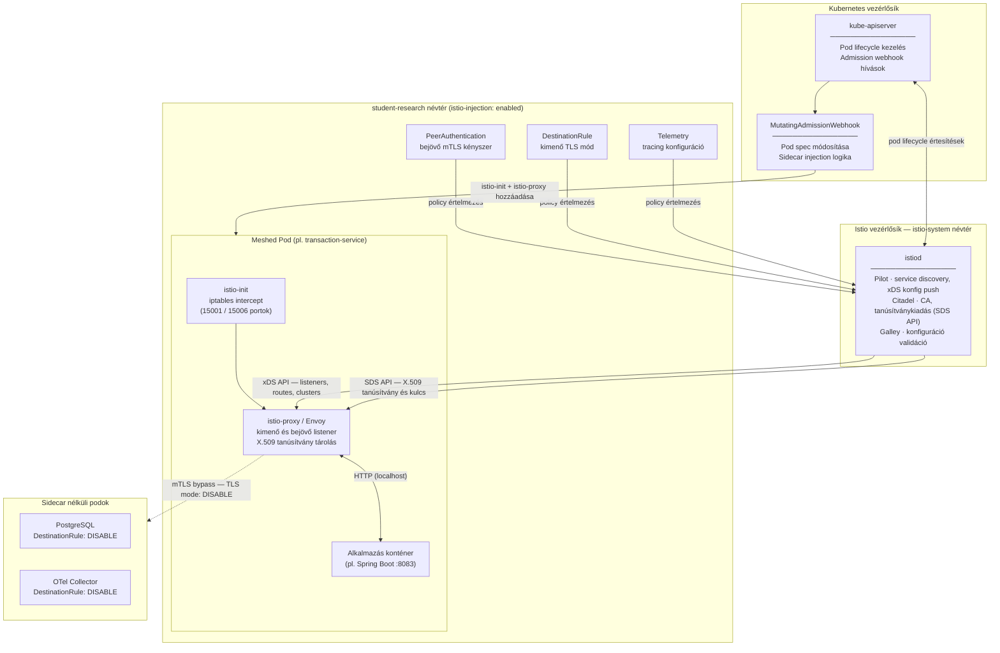
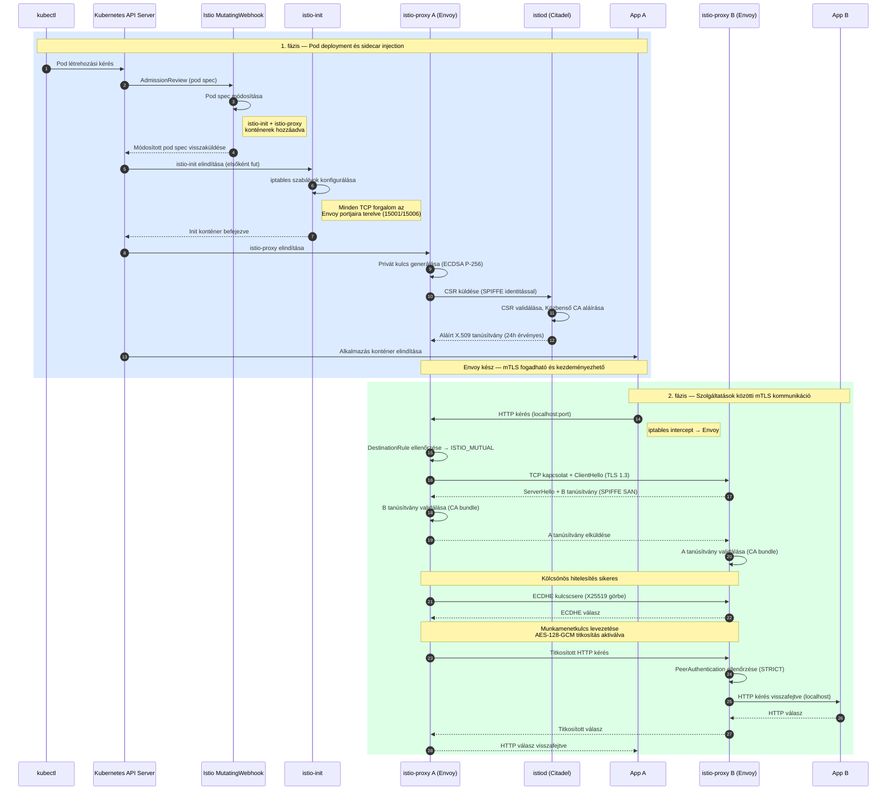

# Istio mTLS, SPIFFE és PKI
## Átfogó műszaki dokumentáció
*Szolgáltatások közötti kommunikáció biztonsága Kubernetes környezetben Istio service mesh segítségével*

---

## 1. Áttekintés

Ez a dokumentum átfogóan bemutatja, hogyan valósul meg a szolgáltatások közötti kommunikáció biztonsága egy Istio service mesh-ben. A leírás három egymásra épülő pillérre fókuszál:

- **mTLS (mutual TLS)** — titkosított és kölcsönösen hitelesített kommunikáció a szolgáltatások között
- **PKI (nyilvános kulcsú infrastruktúra)** — a tanúsítványalapú identitást megalapozó bizalmi keretrendszer
- **Envoy proxy konfiguráció** — az adatsíkon működő komponens, amely érvényesíti a biztonsági szabályzatokat

Ezek a komponensek együttesen megvalósítják a Zero Trust hálózati modellt Kubernetes-ben, biztosítva, hogy minden kapcsolat hitelesített és titkosított legyen, függetlenül a hálózati helytől.

---

## 2. Alapfogalmak

### 2.1 PKI — Nyilvános Kulcsú Infrastruktúra

A PKI egy olyan rendszer, amely tanúsítványok segítségével teszi lehetővé a kölcsönös hitelesítést és a bizalom felépítését a szolgáltatások között. Ez az Istio biztonsági modelljének alapköve.

A PKI legfontosabb elemei:
- **Kulcspár** — minden munkaterhelés saját nyilvános és privát kulcsot generál
- **X.509 tanúsítvány** — egy identitáshoz köti a nyilvános kulcsot
- **Hitelesítő hatóság (CA)** — az a megbízható entitás, amely aláírja a tanúsítványokat
- **Bizalmi lánc** — Gyökér CA → Közbenső CA → Munkaterhelés-tanúsítvány

A PKI identitást és bizalmat biztosít, de maga nem végez adattitkosítást — ez a TLS feladata.

### 2.2 SPIFFE — Biztonságos Termelési Identitás Keretrendszer

A SPIFFE egy nyílt szabvány, amely URI formátumban határozza meg a munkaterhelés-identitást. Az Istio-ban minden munkaterhelés kap egy SPIFFE identitást, amelyet a tanúsítvány Subject Alternative Name (SAN) mezőjébe ágyaznak be.

A SPIFFE azonosító a Kubernetes névtér és szolgáltatásfiók alapján egyedileg azonosít egy munkaterhelést, lehetővé téve a kriptográfiailag ellenőrizhető szolgáltatásszintű engedélyezést.

### 2.3 mTLS — Kölcsönös TLS

A hagyományos TLS csak a szervert hitelesíti a kliens felé. Az mTLS ezt kiterjeszti: mindkét fél bemutatja és validálja a másik tanúsítványát, kétirányú bizalmat létrehozva. Az mTLS kézfogás során mindkét fél X.509 tanúsítványt mutat be, validálja a másik tanúsítványát egy megbízható CA-val szemben, majd közösen egyeztet egy szimmetrikus titkosítókulcsot — ezután a teljes kommunikáció titkosított csatornán folyik.

---

## 3. Az Istio CA hierarchia

Az Istio rétegelt tanúsítványhierarchiát alkalmaz a biztonság és az üzemeltetési rugalmasság egyensúlyban tartásához:

- **Gyökér CA** — körülbelül tíz éves érvényességi idővel, soha nem kerül közvetlenül a hálózatra
- **Közbenső CA** — körülbelül egy éves érvényességgel, ez végzi a napi aláírásokat
- **Munkaterhelés-tanúsítvány** — mindössze 24 óráig érvényes, automatikusan megújítva

A rövid érvényességi idő kulcsfontosságú: ha egy munkaterhelés-tanúsítvány kompromittálódik, az legfeljebb 24 óra múlva érvényét veszti. A gyökér CA privát kulcsa offline marad, a közbenső CA kompromittálódása nem veszélyezteti a teljes hierarchiát.

---

## 4. Telepítés Kubernetes-ben

### 4.1 A vezérlősík és a névterek előkészítése

Az Istio telepítése két névtér létrehozásával és konfigurálásával kezdődik. Az **istio-system** névtérbe kerül maga az Istio vezérlősíkja — elsősorban az **istiod** nevű komponens. A munkaterheléseket futtató névtérre (jelen projektben: **student-research**) egy speciális `istio-injection: enabled` jelölőt (label) kell elhelyezni.

Ez a label közli a Kubernetes admission webhook mechanizmusával, hogy ebbe a névtérbe kerülő minden podba automatikusan be kell injektálni az Istio adatoldali proxyját. Ez az injekciós mechanizmus az egész biztonsági modell alapja — maga az alkalmazáskód nem tud arról, hogy egy proxy veszi körbe.

### 4.2 istiod — az Istio vezérlősík

Az **istiod** egy egységes vezérlősík-bináris, amely három korábban különálló Istio komponens feladatait látja el:

- **Pilot**: figyeli a Kubernetes API-t (Services, Endpoints), és proxy-konfigurációkat generál minden sidecar számára
- **Citadel**: a hitelesítő hatóság (CA) szerepét tölti be — kiadja és megújítja a munkaterhelés-tanúsítványokat
- **Galley**: konfiguráció-validáció és -elosztás

Az istiod az **xDS protokoll** segítségével dinamikusan terjeszti a konfigurációt az Envoy proxy-khoz újraindítás nélkül. A **Secret Discovery Service (SDS)** API-n keresztül a proxy-k lekérik a TLS tanúsítványaikat és kulcsaikat is.

### 4.3 Kubernetes és Istio komponensek — áttekintő diagram

Az alábbi komponens diagram az Istio és a Kubernetes érintett rétegeit, azok kapcsolatait és a MicroBank projektben nem meshed podok kivételkezelését mutatja be.

---

## 5. Konténer deployment és sidecar injection

### 5.1 Az injekciós folyamat

Amikor egy pod indul a jelölt névtérben, a következő lépések zajlanak le automatikusan, még mielőtt az alkalmazáskonténer egyáltalán elindulna:

1. A Kubernetes API szerver fogadja a pod-létrehozási kérést, és átadja az Istio **MutatingAdmissionWebhook**-jának.
2. Az Istio webhook módosítja a pod specifikációját: hozzáad egy **istio-init** init-konténert és egy **istio-proxy** (Envoy) sidecar konténert.
3. Az init-konténer lefut az alkalmazás előtt, és **iptables szabályokat** konfigurál a pod hálózati névterében — ezek a szabályok az összes bejövő és kimenő TCP forgalmat az Envoy proxy portjaira irányítják át.
4. Ezután indul el az alkalmazáskonténer, amelyet már körülvesz az Envoy sidecar.

Az eredmény: az alkalmazás azt hiszi, hogy direktben kommunikál a többi szolgáltatással, miközben valójában minden forgalom az Envoy proxyn keresztül halad — az alkalmazás erről semmit nem tud, és semmilyen módosítást nem igényel.

### 5.2 Tanúsítványok kiadása pod indításkor

Miután az Envoy sidecar elindult, elvégzi az identitásregisztrációt:

1. Az Envoy a pod belsejében generál egy privát kulcsot — ez a kulcs soha nem hagyja el a podot.
2. Létrehoz egy **Certificate Signing Request (CSR)** kérelmet, amely tartalmazza a munkaterhelés SPIFFE identitását (névtér + szolgáltatásfiók).
3. A CSR-t elküldi az istiod-nak az SDS API-n keresztül.
4. Az istiod validálja a kérést, majd a Közbenső CA-val aláírja az új tanúsítványt.
5. Az Envoy megkapja az aláírt tanúsítványt, és megkezdheti az mTLS kapcsolatok létrehozását és fogadását.

### 5.3 Tanúsítványok megújítása

A munkaterhelés-tanúsítványok 24 óráig érvényesek. Az Envoy proaktívan megújítja a tanúsítványt a lejárat előtt — a folyamat teljesen transzparens, nem igényel alkalmazás-újraindítást, és a meglévő kapcsolatokat sem szakítja meg.

---

## 6. mTLS kézfogás folyamata

### 6.1 Mikor zajlik le?

A TLS kézfogás TCP-kapcsolatonként egyszer zajlik le, nem minden HTTP kérésre külön. Az Envoy kapcsolatkészleteket (connection pool) tart fenn az egyes cél-szolgáltatásokhoz, így egyetlen kézfogás akár több ezer kérést is lefedhet. A HTTP/2 multiplexálás tovább csökkenti az overheadet: ugyanazon a kapcsolaton párhuzamos kérések is futhatnak.

### 6.2 A kézfogás lépései

Amikor az A szolgáltatás kapcsolódni kíván a B szolgáltatáshoz:

1. Az A pod alkalmazása HTTP kérést küld a B szolgáltatás lokális portjára. Az iptables szabályok az Envoy kimeneti listenerére irányítják a forgalmat.
2. Az A pod Envoy proxy-ja kikeresi a célhoz tartozó routing és TLS szabályokat.
3. TCP kapcsolat épül ki az A és B pod Envoy proxy-ja között.
4. Az A Envoy elküldi a ClientHello üzenetet — javasolt TLS verzió és titkosítóalgoritmusok.
5. A B Envoy válaszol a saját tanúsítványával, amelynek SAN mezőjébe a SPIFFE identitása van beágyazva.
6. Az A Envoy validálja a kapott tanúsítványt az istiod-tól kapott CA-bundle segítségével.
7. Az A Envoy elküldi a saját tanúsítványát.
8. A B Envoy ugyanúgy validálja az A tanúsítványát.
9. Mindkét fél ECDHE kulcscsere útján egyeztet egy szimmetrikus munkamenetkulcsot.
10. Az ettől kezdődő kommunikáció titkosított csatornán folyik.

### 6.3 Kriptográfiai algoritmusok

Az Istio TLS 1.3-at használ, amely a TLS protokoll jelenlegi legbiztonságosabb verziója. A TLS 1.3 leegyszerűsítette a kézfogási folyamatot és eltávolította a régebbi, gyengébb algoritmusokat, amelyek korábbi verziókban még jelen voltak.

**Munkaterhelés-tanúsítványok — RSA-2048 és ECDSA P-256**

A tanúsítványokban szereplő aszimmetrikus kulcspárok két algoritmuscsaládból kerülnek ki. Az **RSA-2048** egy hagyományos, széleskörűen támogatott algoritmus, amelynek biztonsága nagyszámok faktorizálásának nehézségén alapul — a 2048-as szám a kulcs bitméretét jelenti, ami ma még kellő védelmet nyújt. Az **ECDSA P-256** (Elliptic Curve Digital Signature Algorithm) ezzel szemben elliptikus görbékre épülő matematikát használ. A P-256 jelölés az adott görbét azonosítja. Az ECDSA lényegesen rövidebb kulcsokkal nyújt ugyanolyan biztonsági szintet, mint az RSA — a P-256-os kulcs hozzávetőlegesen egy 3072 bites RSA kulccsal egyenértékű, miközben töredéke a mérete. Ezért az ECDSA-alapú tanúsítványok generálása, aláírása és ellenőrzése is gyorsabb.

**Kulcscsere — ECDHE (Elliptic Curve Diffie-Hellman Ephemeral)**

A kézfogás során a két fél nem közvetlenül adja át egymásnak a titkosítókulcsot — azt soha nem küldik el a hálózaton. Ehelyett az **ECDHE** protokoll segítségével mindkét fél nyilvánosan látható értékeket cserél, amelyekből mindkettő — és csakis ők — ugyanazt a titkos munkamenetkulcsot tudja levezetni. A folyamat az elliptikus görbe matematikájára támaszkodik. Az "Ephemeral" (rövid élettartamú) jelző azt jelenti, hogy minden egyes kapcsolathoz új, egyszer használatos kulcspárt generálnak — ez biztosítja az ún. **forward secrecy** tulajdonságot: ha egy korábbi privát kulcs utólag kompromittálódna, a múltbeli titkosított forgalom akkor sem fejthető vissza, mert az ahhoz használt egyszer érvényes munkamenetkulcs már megsemmisült.

**Szimmetrikus titkosítás — AES-GCM**

Miután a munkamenetkulcs megvan, az adatok tényleges titkosítása szimmetrikus algoritmussal történik — ez lényegesen gyorsabb, mint az aszimmetrikus kriptográfia. Az **AES** (Advanced Encryption Standard) a ma legelterjedtebb szimmetrikus titkosítóalgoritmus, amelyet az USA szövetségi szabványügyi hivatala (NIST) írt elő. A **GCM** (Galois/Counter Mode) az AES egy üzemmódja, amely nemcsak titkosítást, hanem egyidejűleg integritásvédelmet (hitelesítő kódot, MAC) is biztosít. Ez az AEAD (Authenticated Encryption with Associated Data) tulajdonság azt jelenti, hogy ha valaki megpróbálja manipulálni az átvitel közbeni titkosított adatot, a fogadó fél ezt azonnal észleli, és elveti a csomagot. Az AES-128-GCM 128 bites, az AES-256-GCM 256 bites kulcsot alkalmaz — mindkettő kellően erős, az utóbbi extra védettséget nyújt kifejezetten magas biztonsági követelmények esetén.

### 6.4 Deployment és kommunikáció — szekvenciadiagram

Az alábbi diagram két egymást követő fázist mutat be: először a pod deploymentkor zajló sidecar injekciót és tanúsítványkérést, majd a futó szolgáltatások közötti tényleges mTLS kommunikációt.

---

## 7. Forgalomirányítási szabályzatok

### 7.1 PeerAuthentication — bejövő forgalom

A **PeerAuthentication** egy Istio-specifikus erőforrásfajta (CRD), amely a bejövő forgalomra vonatkozó mTLS szabályzatot határozza meg.

Három üzemmód létezik:

- **STRICT** — kizárólag mTLS forgalmat fogad el; minden titkosítatlan kapcsolatot visszautasít. Ez a Zero Trust éles üzemi állapota.
- **PERMISSIVE** — elfogad mTLS és titkosítatlan forgalmat egyaránt. Átmeneti állapothoz, legacy szolgáltatások bevonásához hasznos.
- **DISABLE** — teljesen letiltja az mTLS-t, csak titkosítatlan kapcsolatokat fogad el. Hibakereséshez vagy nem meshed hívók integrációjához szükséges.

A jelen projektben a névtér egésze STRICT módban fut, de az egyes belépési pontokon (api-gateway, frontend) portszinten PERMISSIVE kivétel érvéyes — azért, mert a külső NGINX ingress controller nem meshed, és nem tud mTLS-t küldeni.

### 7.2 DestinationRule — kimenő forgalom

Míg a PeerAuthentication a szerver oldalát (bejövő) szabályozza, a **DestinationRule** a kliensoldalt (kimenő forgalom) konfigurálja. Megadja, hogy egy adott célhoz küldött forgalmat milyen TLS üzemmódban kell kezelni.

A leggyakoribb üzemmód az **ISTIO_MUTUAL**, amelynél az Istio automatikusan biztosítja a tanúsítványokat a kliens Envoy proxy számára — az alkalmazásnak semmiféle TLS konfigurációt nem kell végzenie.

A projektben egy névtérszintű alap DestinationRule van érvényben, amely az összes belső szolgáltatásra ISTIO_MUTUAL módot ír elő. Ezen felül két kivétel szerepel:
- A **Postgres adatbázis** kap egy DISABLE szabályt, mivel nem rendelkezik sidecar-ral és nem tud mTLS-t fogadni. Ennek hiányában az adatbázist használó szolgáltatások indításkor CrashLoop állapotba esnek.
- Az **OTel collector** szintén DISABLE kivételt kap ugyanezen okból.

---

## 8. Telemetria

Az Istio **Telemetry** erőforrásán keresztül konfigurálja a nyomkövetést (tracing). A projektben minden kérés 100%-ban nyomkövetett, és az adatok az OTel collectorra kerülnek. Az Istio az Envoy proxy szintjén automatikusan propagálja a trace kontextust a szolgáltatások között (W3C Trace Context fejlécek), így az elosztott nyomkövetés az alkalmazáskód módosítása nélkül is működik.

---

## 9. A teljes kommunikációs folyamat

Az alábbiakban nyomon követhető egy pénzátutalási kérés útja a MicroBank rendszerben, Istio mTLS mellett:

**1. Külső kérés belépése:**
Az NGINX ingress controller HTTPS kérést küld az api-gateway-nek a 8080-as porton. Ez a port PERMISSIVE módban van konfigurálva, így a nem meshed NGINX is tud kapcsolódni — az Istio proxy fogadja a plaintext forgalmat.

**2. Belső hívás: api-gateway → transaction-service:**
Az api-gateway alkalmazása HTTP kérést küld a transaction-service-nek. Az iptables szabályok az Envoy kimeneti listenerére irányítják ezt a forgalmat. Az Envoy ellenőrzi a DestinationRule-t (ISTIO_MUTUAL), elvégzi az mTLS kézfogást a transaction-service Envoy proxy-jával, majd titkosított csatornán küldi a kérést.

**3. A transaction-service-től induló lánc:**
A transaction-service a kérés feldolgozása során maga is hív más szolgáltatásokat: account-service-t (egyenleg ellenőrzés, terhelés/jóváírás), fraud-service-t (tranzakciós ellenőrzés), exchange-service-t (devizaárfolyam), notification-service-t (értesítés) és audit-service-t (naplózás). Minden egyes ilyen hívás ugyanazon az mTLS-csatornán halad — automatikusan, az alkalmazáskód tudta nélkül.

**4. Adatbázis-kapcsolat:**
Az account-service a Postgres felé is kapcsolódik. Ez nem megy az mTLS csatornán — a DestinationRule DISABLE kivétele értelmében a Postgres-hez irányuló forgalom titkosítatlan TCP marad. A Postgres nem rendelkezik Envoy sidecar-ral, ezért nem tudna mTLS-t fogadni.

---

## 10. Biztonsági előnyök

Az Istio service mesh az alábbi Zero Trust biztonsági tulajdonságokat valósítja meg:

- **Hálózati Zero Trust**: minden kapcsolathoz kölcsönös tanúsítvány-hitelesítés szükséges; az IP-cím alapú bizalom nem értelmezhető.
- **Automatikus identitáskezelés**: tanúsítványok kiadása és megújítása automatikusan, istiod által — manuális PKI műveletek nélkül.
- **Rövid élettartamú hitelesítők**: a 24 órás munkaterhelés-tanúsítványok drámaian csökkentik a kulcskompromittálódás kockázatát.
- **Adattitkosítás átvitel közben**: minden mesh-forgalom alapértelmezetten titkosított AES-GCM algoritmussal.
- **Munkaterhelés-izoláció**: a SPIFFE azonosítók lehetővé teszik a részletes, szolgáltatásfiók-szintű engedélyezési szabályok (AuthorizationPolicy) alkalmazását.
- **Auditálhatóság és megfigyelhetőség**: az mTLS identitás elérhető a hozzáférési naplókban, metrikákban és elosztott nyomkövetési adatokban.

---

## 11. Az Istio mentális modellje

Az Istio biztonsági architektúrája négy egymást kiegészítő rendszer összehangolt működésén alapul:

- **PKI**: identitást és bizalmat biztosít — *ki vagy?*
- **SPIFFE / X.509**: a munkaterhelés-identitást ellenőrizhető tanúsítványba kódolja
- **TLS / mTLS**: titkosítást és kölcsönös hitelesítést biztosít — *bizonyítsd be*
- **Envoy proxy**: transzparensen érvényesíti a szabályzatokat — az alkalmazáskód módosítása nélkül
- **istiod**: hangolja össze az egész rendszert — konfiguráció, tanúsítványok és megfigyelhetőség

Együttesen egy termelési szintű Zero Trust biztonsági állást valósítanak meg Kubernetes-ben: minden kapcsolat hitelesített, minden bájt titkosított, és a hozzáférés munkaterhelés-identitás szintjén ellenőrzött.
