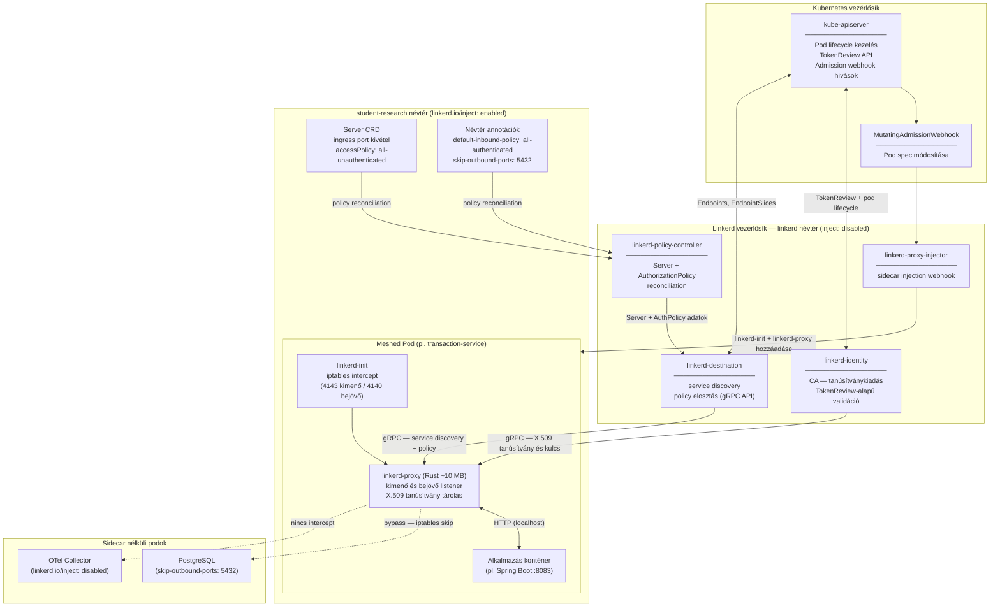
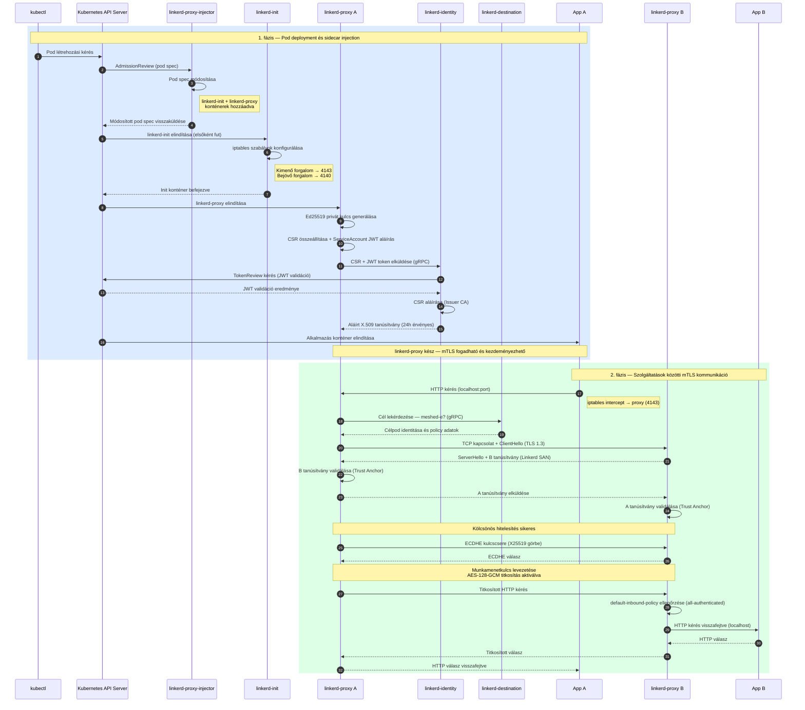

# Linkerd mTLS, munkaterhelés-identitás és engedélyezés
## Átfogó műszaki dokumentáció
*Szolgáltatások közötti kommunikáció biztonsága Kubernetes környezetben Linkerd service mesh segítségével*

---

## 1. Áttekintés

Ez a dokumentum tükörképe az Istio dokumentációnak, és bemutatja, hogyan valósul meg a szolgáltatások közötti kommunikáció biztonsága Linkerd alatt. A két mesh ugyanazt a problémát oldja meg — a Zero Trust kelet-nyugati forgalmat —, de lényegesen eltérő tervezési döntésekkel. A három pillér megegyezik:

- **mTLS (mutual TLS)** — titkosított és kölcsönösen hitelesített kommunikáció
- **PKI (nyilvános kulcsú infrastruktúra)** — az identitást megalapozó bizalmi keretrendszer
- **linkerd-proxy** — az adatsíkon működő komponens, amely érvényesíti a szabályzatokat

Ahol az Istio egy általános célú Envoy sidecar-t (~50 MB RAM, C++ implementáció) alkalmaz, a Linkerd egy célirányosan épített, Rust nyelven írt **mikro-proxy**-t (~10 MB RAM) használ, amely kizárólag HTTP/1, HTTP/2, gRPC és átlátszó TCP forgalmat kezel. Ez a kisebb hatókör magyarázza a Linkerd alacsonyabb késleltetését a közzétett teljesítmény-benchmarkokban — és ez az összehasonlítás alapja a jelen disszertációban.

---

## 2. Alapfogalmak

### 2.1 PKI a Linkerd-ben

A Linkerd bizalmi modellje rétegelt CA-hierarchiára épül, hasonlóan az Istio-hoz:

- **Trust Anchor (Gyökér CA)** — körülbelül egy éves érvényességgel, az operátor kezeli; ez az egyetlen fürtszintű bizalmi gyökér
- **Issuer CA (Kiadó CA)** — szintén körülbelül egy éves érvényességgel, a linkerd-identity komponens tárolja; ez írja alá a munkaterhelés-tanúsítványokat
- **Munkaterhelés-tanúsítvány** — 24 óráig érvényes, automatikusan rotálva a proxy által

A Trust Anchor a `linkerd-identity-trust-roots` ConfigMap-ben él, és csak az operátor munkaállomásán található meg fizikailag. A gyökér soha nem kerül hálózati expozícióba.

### 2.2 Munkaterhelés-identitás

A Linkerd a munkaterheléseket Kubernetes **ServiceAccount** és **névtér** alapján azonosítja. Az identitás DNS-szerű formátumú, és a tanúsítvány SAN mezőjébe van beágyazva. Ez funkcionálisan egyenértékű az Istio SPIFFE URI azonosítójával — ugyanazok az építőelemek (ServiceAccount + névtér), eltérő kódolással. A Linkerd nem használja a SPIFFE URI sémát, de a bizalmi gyökér ugyanolyan erős kriptográfiai alapokon áll.

### 2.3 mTLS a Linkerd-ben

Az mTLS lényege megegyezik az Istio dokumentációban leírtakkal: mindkét fél X.509 tanúsítványt mutat be, mindkettő validálja a másikét, majd munkamenetkulcsot egyeztetnek. A különbség az, hogy **melyik vezérlősík-komponens adja ki a tanúsítványt**, és **melyik proxy zárja le a kapcsolatot**.

Kulcsfontosságú különbség az Istio-tól: a Linkerd-nél az mTLS titkosítás **nem kapcsolható ki** meshed pod-ok között. Amit be és ki lehet kapcsolni, az az engedélyezési kényszerítés (authorization enforcement) — az, hogy a nem-mTLS hívókat elutasítja-e a rendszer.

---

## 3. A Linkerd CA hierarchia

| Komponens | Érvényesség | Szerepe |
|---|---|---|
| Trust Anchor | ~1 év (ajánlott) | Bizalom gyökere, aláírja a Kiadó CA-t. Csak a `linkerd-identity-trust-roots` ConfigMap-ben és az operátor munkaállomásán él. |
| Issuer CA | ~1 év | Aláírja a munkaterhelés-tanúsítványokat. A `linkerd-identity` Deployment tárolja. cert-manager integrációval automatikusan rotálható. |
| Munkaterhelés-tanúsítvány | 24 óra | Minden meshed pod kap egyet. A proxy maga rotálja a lejárat előtt. |

Az Istio-tól eltérően — ahol az istiod egyetlen bináris kezeli a discovery-t, a konfigurációt és a CA-feladatokat — a Linkerd ezeket külön deploymentekre osztja. Ez szándékos biztonsági döntés: ha a CA kompromittálódik, a service discovery tovább fut.

---

## 4. Telepítés Kubernetes-ben

### 4.1 CRD-k telepítése

A Linkerd telepítésének első lépése az összes egyedi Kubernetes erőforrásfajta (CRD) telepítése. Ezek definiálják az olyan Linkerd-specifikus objektumokat, mint a `Server`, az `AuthorizationPolicy`, a `MeshTLSAuthentication` és hasonlók. A CRD-k nélkül a vezérlősík nem tud elindulni, mert az általa kezelt erőforrástípusok nem lennének ismertek a Kubernetes API-szerver számára.

A projektben a `linkerd-crds.yaml` fájl tartalmazza ezeket a definíciókat.

### 4.2 A vezérlősík telepítése

A vezérlősíkot a `linkerd-control-plane.yaml` fájl telepíti, amely a következő különálló komponenseket hozza létre a `linkerd` névtérben:

**linkerd-identity** — a Hitelesítő Hatóság (CA). Fogadja a proxy-któl érkező tanúsítványkéréseket (CSR-eket), validálja azokat a Kubernetes TokenReview API-n keresztül, majd aláírja az Issuer CA-val. Ez az a komponens, amely a munkaterhelések identitását meggyőzi.

**linkerd-destination** — a service discovery és policy elosztó. Figyeli a Kubernetes API-t (Endpoints, EndpointSlices, ServiceProfile-ok, policy CRD-k), és ezeket az adatokat elérhetővé teszi a proxy-k számára egy gRPC API-n keresztül. A proxy-k erről a komponensről kérdezik le, hogy egy adott célhoz milyen policy vonatkozik.

**linkerd-proxy-injector** — a MutatingAdmissionWebhook. Ez a komponens felelős azért, hogy az annotált névterekbe kerülő podokba automatikusan bejuttassa a `linkerd-proxy` és `linkerd-init` konténereket.

**linkerd-policy-controller** — a policy CRD-k (Server, AuthorizationPolicy) reconciliation-jét végzi, és betölti ezeket a linkerd-destination policy-nézetébe.

A vezérlősík saját `linkerd` névterében fut, amelyre az `linkerd.io/inject: disabled` annotáció vonatkozik — a vezérlősík maga nem kap proxy sidecar-t.

### 4.3 Kubernetes és Linkerd komponensek — áttekintő diagram

Az alábbi komponens diagram a Linkerd négy különálló vezérlősík-komponensét, az adatsík proxy felépítését, valamint a MicroBank projektben alkalmazott policy- és bypass-mechanizmusokat mutatja be.

---

## 5. Konténer deployment és sidecar injection

### 5.1 A névtér annotálása

A Linkerd névtér-alapú proxy injekciójához **annotációt** (annotation) kell elhelyezni a névtéren — ez az Istio label-alapú megközelítésétől eltérő. Az `linkerd.io/inject: enabled` annotáció közli a proxy-injector webhook-kal, hogy ebbe a névtérbe kerülő podokat szidecar-ral kell ellátni.

A projektben ezen felül egy `config.linkerd.io/skip-outbound-ports: "5432"` annotáció is szerepel a névtéren. Ez arra utasítja a proxy-t, hogy a Postgres felé irányuló kimenő kapcsolatokat (5432-es port) ne intercept-elje — a Postgres nem meshed, ezért a proxy-n átmenő forgalom felesleges overhead lenne.

### 5.2 Az injekciós folyamat

Amikor egy pod indul az annotált névtérben:

1. A Kubernetes API szerver átadja a pod-létrehozási kérést a **linkerd-proxy-injector** webhook-nak.
2. A webhook módosítja a pod specifikációját: hozzáad egy **linkerd-init** init-konténert és egy **linkerd-proxy** sidecar konténert.
3. A `linkerd-init` init-konténer lefut az alkalmazás előtt, és **iptables szabályokat** állít fel a pod hálózati névterében — az összes bejövő és kimenő TCP forgalmat a linkerd-proxy portjaira irányítva (4140 bejövő, 4143 kimenő).
4. Az alkalmazáskonténer elindul, és ettől kezdve minden hálózati forgalma a linkerd-proxy-n halad keresztül, anélkül hogy tudna erről.

### 5.3 Tanúsítványok kiadása pod indításkor

A `linkerd-proxy` az elindulás után azonnal megszerzi a munkaterhelés-tanúsítványát:

1. A proxy **Ed25519** privát kulcsot generál a pod belsejében — ez soha nem hagyja el a podot.
2. Létrehoz egy CSR-t (tanúsítványkérést) a munkaterhelés identitásával, és azt a pod ServiceAccount JWT tokenjével írja alá.
3. A CSR-t és a JWT-t elküldi a `linkerd-identity` komponensnek.
4. A `linkerd-identity` a Kubernetes TokenReview API-n keresztül validálja a JWT-t — így a Linkerd identitásállítása ugyanabba a bizalomba gyökerezik, amelyet a kubelet is használ.
5. A sikeres validáció után a `linkerd-identity` aláírja a CSR-t az Issuer CA-val.
6. A proxy megkapja a tanúsítványt, és megkezdheti az mTLS kapcsolatok létrehozását és fogadását.

### 5.4 Tanúsítvány-rotáció

A munkaterhelés-tanúsítványok 24 óráig érvényesek. A proxy proaktívan megújítja a tanúsítványt a lejárat előtt körülbelül 10 perccel. A rotáció teljesen transzparens: a meglévő kapcsolatok nem szakadnak meg — az új tanúsítvány a következő kézfogásnál lép életbe, a folyamatban lévő kérések pedig a már egyeztetett munkamenetkulcsot használják tovább.

---

## 6. mTLS kézfogás folyamata

### 6.1 Mikor zajlik le?

TCP-kapcsolatonként egyszer. A `linkerd-proxy` hosszú élettartamú HTTP/2 kapcsolatokat tart fenn az upstream peerekhez, így egyetlen kézfogás akár több ezer kérés overheadjét amortizálja — ugyanaz a minta, mint az Envoy esetén.

### 6.2 A kézfogás lépései

A kézfogás lépései megegyeznek az Istio dokumentációban leírtakkal: TCP kapcsolat felépítése, ClientHello, szerver- és klienstanúsítvány-csere, mindkettő validálása, ECDHE kulcscsere, titkosított kommunikáció. A Linkerd-specifikus különbség az, hogy a tanúsítvány SAN mezőjében a Linkerd-stílusú DNS identitás áll a SPIFFE URI helyett.

### 6.3 Kriptográfiai algoritmusok

| Primitív | Linkerd választása | Istio (alapértelmezett) |
|---|---|---|
| Munkaterhelés-kulcs típusa | **Ed25519** | RSA-2048 / ECDSA P-256 |
| Kulcscsere | ECDHE (X25519) | ECDHE |
| Szimmetrikus titkosítás | AES-128-GCM (TLS 1.3 alap) | AES-128/256-GCM |
| Integritás | AEAD (GCM részeként) | AEAD |

Az Ed25519 kulcsok és az X25519 kulcscsere lényegesen gyorsabban generálható és ellenőrizhető, mint az RSA — ez az egyik oka annak, hogy a Linkerd kézfogásai olcsóbbak az Istio alapértelmezett RSA pipeline-jánál.

### 6.4 Deployment és kommunikáció — szekvenciadiagram

Az alábbi diagram két fázisban mutatja be a Linkerd működését. Az Istio megfelelő diagramjával összevetve a legfontosabb különbségek: az Ed25519 kulcs, a JWT-alapú tanúsítványkérés TokenReview validációval, a `linkerd-destination` automatikus célfelderítése (DestinationRule nélkül), és a `default-inbound-policy` mint az Istio PeerAuthentication megfelelője.

---

## 7. Engedélyezési szabályzatok

### 7.1 A Linkerd policy megközelítése

A Linkerd engedélyezési modellje alapvetően különbözik az Istio-tól. Míg az Istio-nál a `PeerAuthentication` és a `DestinationRule` külön CRD-k, amelyeket létre kell hozni, a Linkerd-nél a titkosítás mindig aktív a meshed podok között, és az engedélyezési kényszer a névtér annotációján keresztül adható meg.

### 7.2 Alapértelmezett policy módok

A névtér `config.linkerd.io/default-inbound-policy` annotációja határozza meg az alapértelmezett bejövő policy-t:

| Mód | Viselkedés | Istio megfelelője |
|---|---|---|
| `all-unauthenticated` | Minden forgalmat elfogad (de meshed podok között az mTLS titkosítás automatikusan aktív). | PeerAuthentication PERMISSIVE |
| `all-authenticated` | Csak érvényes mTLS identitással rendelkező hívóktól fogad el forgalmat; minden egyéb elutasítva. | PeerAuthentication STRICT |
| `cluster-authenticated` | Mint az `all-authenticated`, de a fürtön belüli nem-hitelesített hívókat is elfogadja. | (nincs pontos Istio megfelelő) |
| `deny` | Minden bejövő forgalmat elutasít. | (AuthorizationPolicy action: DENY globálisan) |

### 7.3 Server — a bejövő port explicit definiálása

A **Server** erőforrás megjelöl egy pod-csoport adott portját mint policy által kezelt belépési pontot. A Server definiálásával felülírható a névtér alapértelmezett policy-ja az adott portra vonatkozóan.

A projektben az ingress belépési pontokhoz (`api-gateway:8080`, `frontend:80`) `accessPolicy: all-unauthenticated` Server erőforrások kerülnek. Ez az Istio `portLevelMtls: PERMISSIVE` mechanizmusának pontos Linkerd megfelelője — azért szükséges, mert az NGINX ingress controller nem meshed, és mTLS identitás nélkül kapcsolódna ezekhez a portokhoz.

### 7.4 Nincs DestinationRule-megfelelő

A Linkerd-nek nincs szüksége kliens oldali TLS-mód konfigurációra. A proxy automatikusan megvizsgálja a célt: ha a cél meshed (azaz van felfedezhető identitása), a proxy automatikusan mTLS-t kezdeményez. Ha a cél nem meshed (pl. egy külső adatbázis), a proxy átlátszó TCP-ként kezeli a forgalmat. Ez eggyel kevesebb erőforrásfajtát jelent az Istio-val szemben.

---

## 8. A teljes kommunikációs folyamat

Az alábbiakban nyomon követhető egy pénzátutalási kérés útja a MicroBank rendszerben, Linkerd mTLS mellett:

**1. Külső kérés belépése:**
Az NGINX ingress controller HTTP kérést küld az `api-gateway` pod 8080-as portjára. Erre a portra egy `Server` erőforrás érvényes `accessPolicy: all-unauthenticated` beállítással, így a nem meshed NGINX is kapcsolódhat.

**2. Belső hívás: api-gateway → transaction-service:**
Az api-gateway alkalmazása kérést küld a transaction-service felé. Az iptables szabályok a `linkerd-proxy` kimeneti iptables hook-jára irányítják a forgalmat (4143-as port). A proxy lekérdezi a `linkerd-destination`-t, azonosítja a célt mint meshed workload-ot, elvégzi az mTLS kézfogást a transaction-service proxy-jával, majd titkosított csatornán küldi a kérést.

**3. A transaction-service-től induló lánc:**
A transaction-service proxy-ja ugyanígy kezeli a kimenő hívásokat az account-service, fraud-service, exchange-service, notification-service és audit-service felé. Minden kérés automatikusan mTLS-en halad, az alkalmazáskód módosítása nélkül.

**4. Adatbázis-kapcsolat:**
Amikor az account-service a Postgres-hez kapcsolódik a 5432-es porton, az iptables szabályok **nem** irányítják ezt a forgalmat a proxy-ra — a névtér `skip-outbound-ports: "5432"` annotációja miatt. A kapcsolat titkosítatlan TCP marad, ahogy a Postgres elvárja.

**5. Inbound policy érvényesítése:**
A transaction-service proxy-jára érkező kapcsolat esetén a proxy ellenőrzi az api-gateway identitástanúsítványát. Ha a névtér `all-authenticated` módban van, és a tanúsítvány érvényes, a forgalom átadódik az alkalmazásnak. Ha a tanúsítvány hiányzik vagy érvénytelen, a kapcsolat elutasítva.

---

## 9. Biztonsági előnyök

A Linkerd ugyanazokat a Zero Trust biztonsági tulajdonságokat valósítja meg, mint az Istio:

- **Hálózati Zero Trust**: minden kapcsolathoz kölcsönös tanúsítvány-hitelesítés szükséges; az IP-cím alapú bizalom nem értelmezhető.
- **Automatikus identitáskezelés**: tanúsítványok kiadása és megújítása automatikusan, `linkerd-identity` által — manuális PKI műveletek nélkül.
- **Rövid élettartamú hitelesítők**: a 24 órás munkaterhelés-tanúsítványok drámaian csökkentik a kulcskompromittálódás kockázatát.
- **Adattitkosítás átvitel közben**: minden meshed-to-meshed forgalom automatikusan TLS 1.3-mal titkosított.
- **Munkaterhelés-izoláció**: ServiceAccount-alapú identitás teszi lehetővé a részletes, pod-szintű engedélyezési szabályok alkalmazását.

---

## 10. A Linkerd mentális modellje

A Linkerd vezérlősíkja és adatsíkja szoros együttműködésben dolgozik:

**Vezérlősík (linkerd névtér):**
- `linkerd-destination` — service discovery és policy elosztás
- `linkerd-identity` — CA, munkaterhelés-tanúsítványok kiadása
- `linkerd-proxy-injector` — webhook, amely injektálja a sidecar-t
- `linkerd-policy-controller` — policy CRD-k reconciliálása

**Adatsík (minden meshed pod):**
- `linkerd-proxy` (Rust mikro-proxy, ~10 MB) — automatikus mTLS, Server/AuthorizationPolicy érvényesítés, per-route retry/timeout, telemetria

**Hálózati forgalom:**
- TLS 1.3 (X25519 + AES-128-GCM)
- Munkaterhelés-identitás minden kapcsolat tanúsítványának SAN mezőjében

---

## 11. Miért Linkerd az Istio mellett (a disszertáció szempontjából)

| Dimenzió | Istio | Linkerd |
|---|---|---|
| Adatsík proxy | Envoy (C++, ~50 MB RSS) | linkerd-proxy (Rust, ~10 MB RSS) |
| Vezérlősík felépítése | Monolitikus `istiod` | Több egyedi célú deployment |
| Proxy kommunikációs protokoll | xDS (Envoy-kompatibilis) | Egyedi gRPC API |
| Munkaterhelés-identitás séma | SPIFFE URI | Kubernetes-stílusú DNS |
| Tanúsítványkulcs típusa (alap) | RSA-2048 | Ed25519 |
| mTLS bekapcsolási modell | Konfigurálható portonként (PeerAuthentication) | Mindig aktív meshed podok között; engedélyezés különválik |
| Funkciófelület | Nagyon széles (egress, WASM szűrők, multicluster, virtual services, gateways…) | Kis és véleményes |
| Várható késleltetési overhead | Magasabb | Alacsonyabb |

A tesztelt hipotézis: a kisebb funkciófelület és a Rust implementáció mérhetően jobb **p99 késleltetést**, **kisebb RSS-t podokonként** és **alacsonyabb CPU-t kérésenként** eredményez a Linkerd esetén, miközben ugyanazt a Zero Trust mTLS biztonsági garanciát nyújtja. A `k6/` könyvtárban lévő forgalmi profilok ugyanazt a pénzátutalási folyamatot hajtják végre mindkét mesh ellen és egy mesh nélküli alapállapot (baseline) ellen is.

---

## 12. Összefoglalás

A Linkerd biztonsági architektúrája ugyanazon négy pillérre épül, mint az Istio-é, de eltérő implementációs döntésekkel, amelyek az üzemeltetési egyszerűséget és a proxy-hatékonyságot helyezik előtérbe a funkciógazdagság helyett:

| Rendszer | Szerepe | Implementáció |
|---|---|---|
| PKI | Identitás és bizalom — *ki vagy?* | Trust Anchor → Issuer CA → 24 órás munkaterhelés-tanúsítványok |
| Munkaterhelés-identitás | Ellenőrizhető tanúsítványba kódolja az identitást | `{sa}.{ns}.serviceaccount.identity.linkerd.cluster.local` SAN |
| TLS / mTLS | Titkosítás + kölcsönös hitelesítés — *bizonyítsd be* | TLS 1.3, Ed25519 kulcsok, automatikus minden meshed pod között |
| linkerd-proxy | Transzparensen érvényesíti a szabályzatokat | Rust mikro-proxy, gRPC konfiguráció a vezérlősíktól |
| Linkerd vezérlősík | Hangolja össze a rendszert | Szétválasztva: destination / identity / injector / policy |

Együttesen ugyanolyan termelési szintű Zero Trust állást valósítanak meg, mint az Istio — minden kapcsolat hitelesített, minden bájt titkosított —, de lényegesen kisebb pod-szintű overheadjel.
