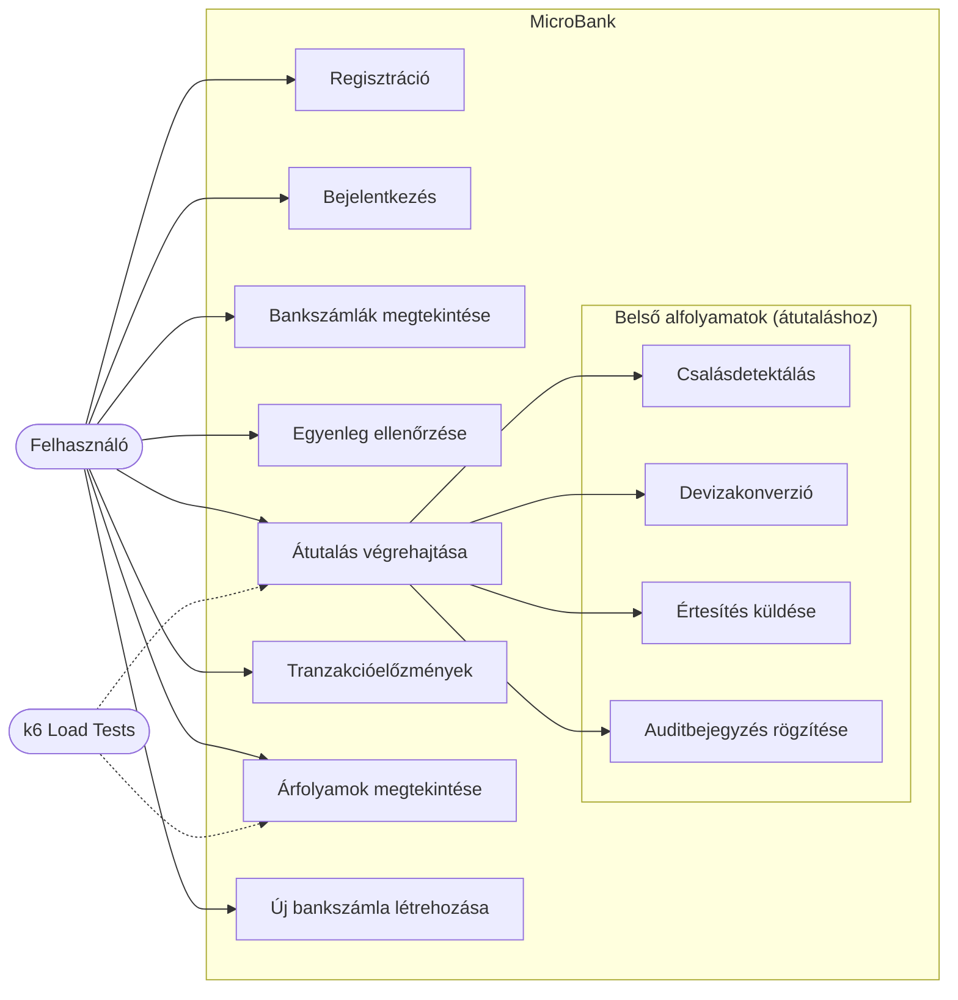
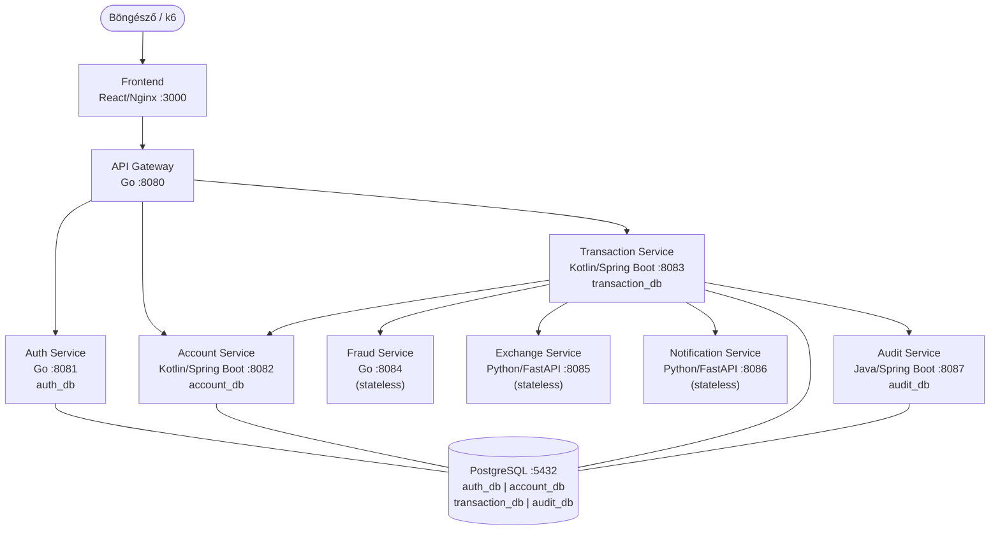
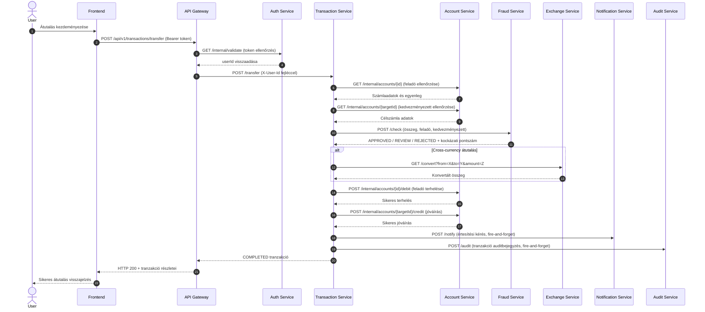
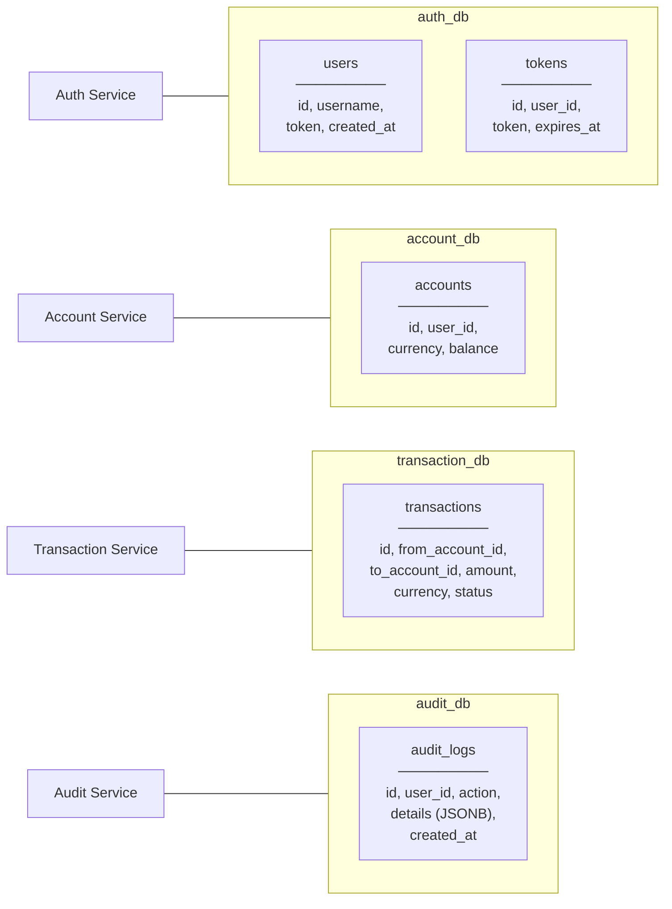
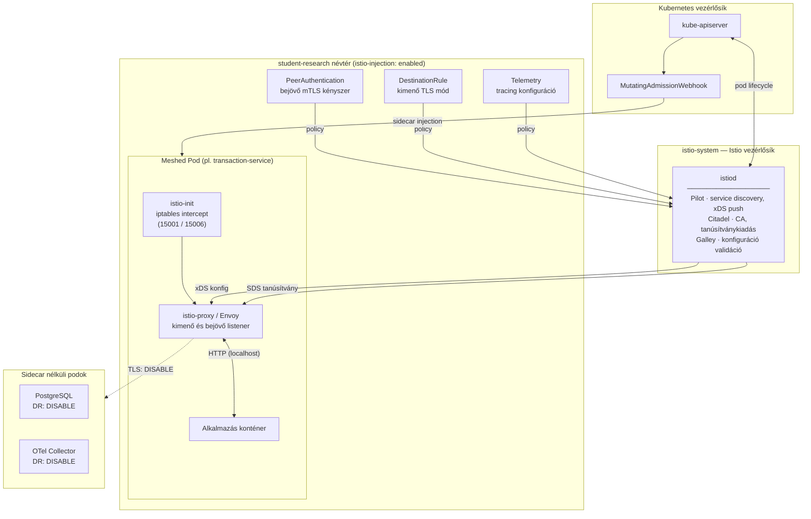
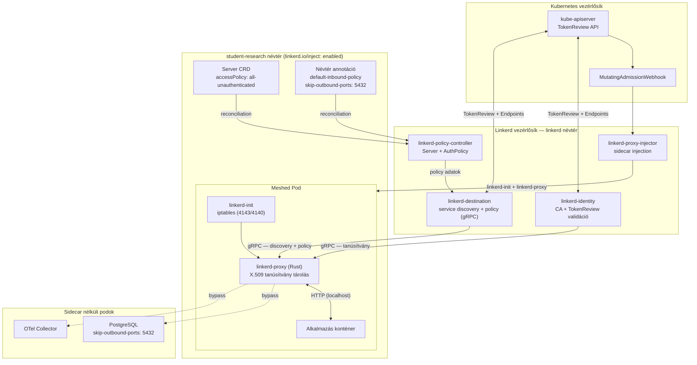

# MicroBank – Projekt dokumentáció
## Mikroszolgáltatás-alapú banki alkalmazás

*Dezső Szabolcs*  
*Koordinátor: Dr. Szántó Zoltán*  
*Szoftver rendszerek modellezése*  
*Sapientia EMTE, Marosvásárhely, 2026*

---

## Tartalomjegyzék

1. [Bevezetés](#1-bevezetés)
2. [A projekt célja](#2-a-projekt-célja)
3. [Projektmenedzsment terv](#3-projektmenedzsment-terv)
4. [Követelmény-elemzés és -specifikáció](#4-követelmény-elemzés-és--specifikáció)
5. [Részletes tervezés](#5-részletes-tervezés)
6. [Fejlesztési eszközök](#6-fejlesztési-eszközök)
7. [Tesztmenedzsment](#7-tesztmenedzsment)
8. [Az alkalmazás működése](#8-az-alkalmazás-működése)
9. [Kutatási eredmények: mTLS teljesítmény-overhead mérése](#9-kutatási-eredmények-mtls-teljesítmény-overhead-mérése)
10. [Összefoglalás](#10-összefoglalás)
- [Ábrák jegyzéke](#ábrák-jegyzéke)
- [Táblázatok jegyzéke](#táblázatok-jegyzéke)
- [Irodalomjegyzék](#irodalomjegyzék)

---

## 1. Bevezetés

A digitális pénzügyi infrastruktúrák korában a mikroszolgáltatás-alapú rendszerek meghatározó szerepet töltenek be a nagyvállalati szoftverek tervezésében. Az ilyen architektúrák számos, egymástól független, hálózaton kommunikáló komponensből épülnek fel, amelyek rugalmasságot, skálázhatóságot és technológiai heterogenitást tesznek lehetővé. Ugyanakkor a szolgáltatások közötti kommunikáció biztonsága és a teljes szoftver ellátási lánc integritása új kihívások elé állítja a szoftverfejlesztőket és az üzemeltetőket. [8]

Jelen dokumentáció a MicroBank projektet ismerteti, amely egy mikroszolgáltatás-alapú, egyszerűsített banki rendszer szimulátora. A projekt célja kettős: egyrészt egy működőképes, realisztikus fintech alkalmazás megvalósítása, másrészt egy MSc-szintű szakdolgozat kutatási terhelési forgatókönyvének (test workload) biztosítása. A kutatás fókuszában a szoftver ellátási lánc biztonsága (Software Supply Chain Security) és a Zero Trust architektúra — különösen a kölcsönös TLS (mTLS) — Kubernetes-környezetekben való alkalmazása áll.

A dokumentum felépítése a szoftvertechnológiai projektdokumentáció bevett struktúráját követi: projektmenedzsment terv, követelmény-elemzés és -specifikáció, részletes tervezés, fejlesztési eszközök bemutatása, tesztmenedzsment, az alkalmazás működésének ismertetése és összefoglalás.

---

## 2. A projekt célja

A MicroBank projekt elsődleges célja egy olyan kutatási platform létrehozása, amelyen mérhetők és összehasonlíthatók a különböző biztonsági megközelítések teljesítményhatásai mikroszolgáltatás-alapú környezetben. A rendszer szándékosan heterogén technológiai stack-et alkalmaz (Go, Kotlin, Java, Python, TypeScript), hogy egy valódi ipari környezetet modellezzen.

A kutatás négy fő pillére a következő:

**Szoftver ellátási lánc biztonság (Software Supply Chain Security):** A konténerizált alkalmazások esetén kritikus kérdés, hogy az üzembe helyezett képek (container images) megbízható forrásból származnak-e, és nem módosultak-e a fejlesztési folyamat során. A Sigstore projekt Cosign eszköze lehetővé teszi a Docker-képek kriptográfiai aláírását és ellenőrzését a CI/CD pipeline részeként. [6]

**Zero Trust architektúra és mTLS:** A Zero Trust biztonsági modell alapelve, hogy egyetlen hálózati résztvevőnek sem szabad alapértelmezés szerint megbízhatónak tekinteni, függetlenül attól, hogy belső vagy külső hálózaton helyezkedik el. A kölcsönös TLS (mTLS) protokoll garantálja, hogy minden szolgáltatások közötti kapcsolat kétirányú tanúsítvány-alapú hitelesítéssel és titkosítással zajlik. A projekt az mTLS teljesítmény-többletterhelését (overhead) méri és dokumentálja különböző terhelési profilok mellett.

**Kubernetes service mesh:** A rendszer Kubernetes-re való telepítése Istio és Linkerd service mesh keretrendszerek segítségével valósult meg. A service mesh transzparensen kezeli az mTLS kommunikációt az alkalmazáskód módosítása nélkül. A két megvalósítás egymás melletti összehasonlítása a kutatás egyik fő mérési tengelye.

**Munkaterhelés-identitás (SPIFFE/SPIRE):** A SPIFFE szabvány (Secure Production Identity Framework for Everyone) egységes munkaterhelés-identitási keretrendszert biztosít, amellyel minden Kubernetes-pod automatikusan rövidéletű X.509 SVID tanúsítványt kap. [5]

---

## 3. Projektmenedzsment terv

### 3.1 Projektcsapat és szerepkörök

A projekt egyéni fejlesztés keretében valósul meg. A fejlesztő felelős a teljes szoftverarchitektúra tervezéséért, implementációjáért, dokumentálásáért és teszteléséért. A témavezető biztosítja a kutatási iránymutatást és felügyeli a dokumentáció minőségét.

| Szerep | Felelős | Feladatkör |
|---|---|---|
| Fejlesztő / Hallgató | Dezső Szabolcs | Architektúra, implementáció, tesztelés, dokumentáció |
| Témavezető | Dr. Márton Gyöngyvér | Kutatási iránymutatás, dokumentáció felülvizsgálata |

### 3.2 Verziókezelés

A forráskód Git verziókezelő rendszerrel és GitHub-hosting platformon kerül tárolásra. A repository `main` és `feature` ágakat tartalmaz. A `main` ágon kizárólag kiadásra kész, tesztelt kód szerepel; a fejlesztési munka a feature branch-eken zajlik. A commit üzenetek Conventional Commits szabványt követnek. A forráskód repository: [dezsokee/microbank](https://github.com/dezsokee/microbank).

### 3.3 Projektmenedzsment eszközök

A feladatok nyomon követésére GitHub Issues szolgálnak. Ezek segítségével könnyedén számon lehet tartani a projekt aktuális állapotát, az egyes feature-k fejlesztésének állapotát. A jövőben tervben van a GitHub Kanban Board bevezetése is.

### 3.4 Mérföldkövek és ütemterv

| Hét | Mérföldkő | Teljesítmény-mutató |
|---|---|---|
| 2. hét | Projekthatókör, repository inicializálása, projektmenedzsment issuek, vezetőtanárral való egyeztetés | Git repository, GitHub Issues, témavezetővel egyeztetett jegyzet |
| 4. hét | Szoftverkövetelmény-specifikáció (SRS) | SRS dokumentum a dokumentáció keretén belül |
| 6. hét | Rendszerarchitektúra, drótváz (wireframe) | Architektúradiagram, wireframe diagramok |
| 8. hét | UML diagramok: use-case, sequence | UML diagramok |
| 9. hét | Egységtesztek, integrációs tesztek, terheléstesztelés k6-tal | Tesztelési riport, k6 eredmények |
| 10. hét | mTLS overhead mérése — plaintext HTTP vs. mTLS összehasonlítás | Összehasonlító benchmark eredmények |
| 11. hét | Teljes projekt dokumentáció, bemutató, működő demo | Dokumentáció + demo |

### 3.5 Repository struktúra

```
microbank/
├── docker-compose.yml          # Helyi fejlesztési orchestráció
├── init.sql                    # Adatbázis inicializálás
├── services/                   # 9 mikroszolgáltatás forráskódja
│   ├── frontend/               # React 18 + TypeScript + Vite
│   ├── api-gateway/            # Go 1.22 + chi
│   ├── auth-service/           # Go 1.22 + chi
│   ├── account-service/        # Kotlin + Spring Boot 3.2.5
│   ├── transaction-service/    # Kotlin + Spring Boot 3.2.5
│   ├── fraud-service/          # Go 1.22 + chi
│   ├── exchange-service/       # Python 3.12 + FastAPI
│   ├── notification-service/   # Python 3.12 + FastAPI
│   └── audit-service/          # Java 21 + Spring Boot 3.2.5
├── k6/                         # Terhelési tesztszkriptek
│   ├── normal-traffic.js
│   ├── peak-traffic.js
│   └── burst-traffic.js
├── helm/
│   ├── microbank/              # Umbrella Helm chart (11 subchart)
│   └── monitoring/             # Prometheus + Grafana chart
├── k8s/
│   ├── istio/                  # Istio service mesh konfiguráció
│   └── linkerd/                # Linkerd service mesh konfiguráció
└── docs/                       # Dokumentáció és diagramok
```

---

## 4. Követelmény-elemzés és -specifikáció

### 4.1 Rendszer áttekintése

A MicroBank egy poliglott mikroszolgáltatás-architektúrán alapuló alkalmazás, amely kilenc önálló szolgáltatásból és egy PostgreSQL adatbázisból áll. A szolgáltatások REST HTTP API-on keresztül kommunikálnak egymással. A rendszer legjellemzőbb tulajdonsága, hogy egyetlen pénzátutalás 6-8 belső szolgáltatások közötti HTTP-hívást generál — ez teszi alkalmassá az mTLS teljesítményterhelés-mérési kutatáshoz.

### 4.2 Szereplők (aktorok)

A rendszerben két emberi és három rendszerszintű szereplő különböztethető meg. Az elsődleges aktor a **felhasználó (ügyfél)**, aki regisztrált banki ügyfélként bejelentkezik a rendszerbe, megtekinti egyenlegét és tranzakciós előzményeit, valamint pénzátutalást hajt végre.

A rendszer oldalán az **API Gateway** kulcsszerepet tölt be mint külső belépési pont, amely hitelesíti a beérkező kéréseket és azokat a megfelelő belső szolgáltatásokhoz továbbítja. Emellett a rendszer tartalmaz számos belső mikroszolgáltatást is, amelyek az egyes funkcionális egységeket valósítják meg.

A külső rendszer aktorok közé tartozik a **k6 terheléstesztelő eszköz**, amely automatizált, szimulált felhasználói munkafolyamatokat generál teljesítménymérés céljából, valamint a **Prometheus és Grafana** megfigyelhetőségi stack. [1] [2]

### 4.3 Funkcionális követelmények

| Azonosító | Követelmény leírása | Prioritás |
|---|---|---|
| FR-01 | A felhasználó felhasználónév alapján be tud jelentkezni és Bearer tokent kap. | Magas |
| FR-02 | A felhasználó lekérdezheti saját bankszámláit és azok egyenlegét. | Magas |
| FR-03 | A felhasználó pénzátutalást hajthat végre két számla között azonos vagy eltérő devizában. | Magas |
| FR-04 | Az átutalás során automatikus csalás-ellenőrzés (fraud detection) zajlik le. | Magas |
| FR-05 | A rendszer devizaárfolyamokat tart nyilván és elvégzi a szükséges konverziókat. | Közepes |
| FR-06 | Minden elvégzett tranzakcióhoz auditnapló-bejegyzés kerül rögzítésre. | Magas |
| FR-07 | Átutalás után a rendszer értesítést küld (szimulált e-mail). | Közepes |
| FR-08 | A felhasználó megtekintheti tranzakciós előzményeit számlaazonosító szerint szűrve. | Magas |
| FR-09 | Minden szolgáltatás `/healthz` végponton jelenti egészségi állapotát. | Magas |
| FR-10 | Minden szolgáltatás Prometheus-kompatibilis `/metrics` végpontot biztosít. | Magas |
| FR-11 | A frontend React SPA öt oldalt biztosít: Login, Dashboard, Transfer, Transactions, Rates. | Közepes |

### 4.4 Nem-funkcionális követelmények

| Kategória | Követelmény |
|---|---|
| Teljesítmény | Normál forgalom (10 VU) esetén p95 válaszidő < 500 ms, hibaarány < 10 %. Csúcsforgalom (50 VU) esetén p95 < 1 s, hibaarány < 15 %. Burst terhelés (100 VU) esetén p95 < 2 s, hibaarány < 20 %. |
| Biztonság | Az összes belső kommunikáció mTLS-sel titkosított (Istio STRICT mód). Az API Gateway minden külső kérést hitelesít. |
| Skálázhatóság | A rendszer Kubernetes-en fut és vízszintesen skálázható (minden szolgáltatás stateless, az adatbázis-kapcsolaton kívül). |
| Megfigyelhetőség | Minden szolgáltatás JSON-strukturált naplókat ír stdout-ra és Prometheus-metrikákat exportál. Grafana dashboardok biztosítanak vizualizációt. |
| Karbantarthatóság | Minden szolgáltatás önállóan újraépíthető és újraindítható Docker multi-stage build-del. Egymástól független telepítés kötelező. |
| Hordozhatóság | A rendszer Docker Compose és Kubernetes (Helm chart) környezetben egyaránt futtatható. |
| Rendelkezésre állás | A tűz-és-felejtsd el jellegű mellékhatások (értesítés, auditbejegyzés) meghibásodása nem akadályozhatja meg az átutalást. |

### 4.5 Use-case diagram — főbb felhasználói forgatókönyvek

Az alábbi diagram a MicroBank rendszer használati eseteit mutatja be. Az elsődleges aktor a felhasználó (User), aki összesen nyolc fő használati esettel lép kapcsolatba: regisztrációval, bejelentkezéssel, bankszámlák megtekintésével, egyenleg ellenőrzésével, átutalás végrehajtásával, tranzakcióelőzmények lekérdezésével, árfolyamok megtekintésével, valamint új bankszámla létrehozásával. A másodlagos aktor a k6 terheléstesztelő eszköz, amely az átutalás végrehajtásához és az árfolyamok lekérdezéséhez kapcsolódik.



---

## 5. Részletes tervezés

### 5.1 Rendszerarchitektúra

A MicroBank API Gateway mintát alkalmaz: minden külső kérés egyetlen belépési ponton (API Gateway, 8080-as port) érkezik be, és onnan kerül továbbításra a megfelelő belső szolgáltatáshoz. A belső szolgáltatások Docker Compose hálózaton kommunikálnak egymással szolgáltatásnév alapú feloldással. Az adatbázis PostgreSQL 16, amely négy izolált logikai adatbázist tartalmaz (auth_db, account_db, transaction_db, audit_db).



A rendszer kilenc mikroszolgáltatásból és egy adatbázis-komponensből áll, amelyek összesen öt különböző technológiai stacket ölelnek fel. A felhasználói felületet egy React 18 alapú, TypeScript és Vite segítségével fejlesztett, Tailwind CSS-sel stílusozott single-page application alkotja, amelyet Nginx szerver szolgál ki a 3000-es porton.

### 5.2 Drótváz-tervek (Wireframe-ek)

Az alkalmazás tervezési fázisában elkészültek a frontend felhasználói felület lo-fi drótváz tervei, amelyek a képernyők elrendezési struktúráját és a főbb komponens-elhelyezéseket mutatják be. A drótváz-tervek hét képernyőt fednek le: bejelentkezés, üres vezérlőpult, számlákat mutató vezérlőpult, átutalási oldal, sikeres átutalás visszajelzés, tranzakciós előzmények és devizaárfolyamok.

### 5.3 Mikroszolgáltatások részletes leírása

#### 5.3.1 API Gateway (Go)

Az API Gateway a rendszer egyetlen külső belépési pontja. Fő feladata: (1) a Bearer token érvényesítése az Auth Service `/internal/validate` végpontjának meghívásával, (2) sikeres hitelesítés esetén az `X-User-Id` fejléc injektálása és a kérés proxyzása a megfelelő háttér-szolgáltatáshoz. Az API Gateway nem tárol állapotot és nincs adatbázis-kapcsolata — könnyen vízszintesen skálázható.

#### 5.3.2 Auth Service (Go)

Egyszerűsített felhasználói hitelesítést valósít meg: a felhasználónév alapján UUID tokent generál minden bejelentkezéskor, amelyet adatbázisban tárol. A jelszó hiánya szándékos kutatási döntés — a disszertáció biztonsági fókusza a szolgáltatások közötti mTLS-en van, nem az alkalmazásszintű felhasználói autentikáción.

#### 5.3.3 Account Service (Kotlin/Spring Boot)

A bankszámlák és egyenlegek kezelését végzi Spring Data JPA és Hibernate ORM segítségével. Induláskor alice, bob és charlie felhasználók számára mintaszámlákat hoz létre (CommandLineRunner). Két végpont-csoportot biztosít: külső (a felhasználó saját számláinak lekérdezéséhez) és belső (a Transaction Service által hívott egyenlegmódosítási műveletek: debit/credit).

#### 5.3.4 Transaction Service (Kotlin/Spring Boot)

A rendszer legösszetettebb komponense, amely orchestrálja a teljes átutalási folyamatot. A tranzakció életciklusa: `PENDING` → `FRAUD_CHECKED` → `PROCESSING` → `COMPLETED | FAILED | REJECTED`. Az orchestráció lépései: (1) feladó egyenlegének és kedvezményezett létezésének ellenőrzése (Account Service); (2) csalás-ellenőrzés (Fraud Service); (3) devizaárfolyam lekérdezése cross-currency átutalás esetén (Exchange Service); (4) feladó terhelése, kedvezményezett jóváírása (Account Service); (5) értesítés küldése (Notification Service); (6) auditbejegyzés rögzítése (Audit Service).

#### 5.3.5 Fraud Detection Service (Go)

Állapot nélküli (stateless) szabálymotort valósít meg. Ellenőrzi az összeghatárokat és az önátutálásokat, majd `APPROVED`, `REVIEW` vagy `REJECTED` minősítéssel és numerikus kockázati pontszámmal tér vissza.

#### 5.3.6 Exchange Rate Service (Python/FastAPI)

Valós idejű árfolyamokat szolgál ki EUR bázisdevizával az exchangerate.host API integrációval. Támogatott devizák: EUR, USD, GBP, HUF, RON, CHF, JPY. Végpontjai: árfolyam-lekérdezés és összegkonverzió. Stateless, adatbázist nem használ.

#### 5.3.7 Notification Service (Python/FastAPI)

Szimulált értesítési szolgáltatás, amely az átutalások elvégzéséről értesítési kéréseket fogad és naplózza azokat (e-mail-küldés szimulációja). Stateless és ephemerális, memóriában tárolja az üzeneteket.

#### 5.3.8 Audit Log Service (Java/Spring Boot)

Auditnapló-bejegyzéseket perzisztál PostgreSQL-be JSONB típusú részlettárolással. Lekérdezési lehetőségek: userId, action és dátumtartomány szerinti szűrés. A Spring Data JPA és Hibernate ORM kezeli az adatbázis-sémát (ddl-auto: update).

### 5.4 Pénzátutalás — szekvenciadiagram

Az alábbi diagram lépésről lépésre mutatja be egyetlen átutalás teljes belső hívássorozatát. Összesen 6-8 belső szolgáltatások közötti HTTP-hívás generálódik, ami az mTLS overhead mérésének alapját képezi.



### 5.5 Nyilvános API-végpontok

A rendszer összes külső kérése az API Gatewayen keresztül érkezik be (`http://localhost:8080`). A hitelesítést igénylő végpontokhoz `Authorization: Bearer <token>` fejléc szükséges.

| Végpont | Metódus | Leírás | Hitelesítés |
|---|---|---|---|
| `/api/v1/auth/register` | POST | Új felhasználó regisztrálása | Nem |
| `/api/v1/auth/login` | POST | Bejelentkezés, Bearer token visszaadása | Nem |
| `/api/v1/accounts/me` | GET | Bejelentkezett felhasználó bankszámlái | Igen |
| `/api/v1/accounts/me/balance` | GET | Egyenleg lekérdezése | Igen |
| `/api/v1/accounts` | POST | Új bankszámla létrehozása | Igen |
| `/api/v1/transactions/transfer` | POST | Pénzátutalás végrehajtása | Igen |
| `/api/v1/transactions` | GET | Tranzakciós előzmények (accountId szűrővel) | Igen |
| `/api/v1/exchange-rates` | GET | Devizaárfolyamok lekérdezése | Igen |

### 5.6 Adatbázis-tervezés

A rendszer az adatbázisonkénti-szolgáltatás (database-per-service) mintát valósítja meg: minden stateful szolgáltatásnak saját, izolált PostgreSQL adatbázisa van. Keresztszolgáltatásos közvetlen adatbázis-hozzáférés nem megengedett — az adatcsere kizárólag REST API-hívásokon keresztül történik.



Az adatbázis-sémát a Spring Boot szolgáltatásoknál Hibernate kezeli automatikusan (`spring.jpa.hibernate.ddl-auto: update`), az Auth Service esetén Go migrációs szkriptek biztosítják a konzisztenciát.

### 5.7 Konténerizáció

Minden mikroszolgáltatás Docker multi-stage build segítségével minimális éles konténerképpé fordul. A build folyamat két fázisból áll: (1) **build stage** — a futtatókörnyezet teljes SDK-jával fordítja le az alkalmazást; (2) **runtime stage** — csak a futtatáshoz szükséges minimális alap-image-t tartalmazza (pl. `scratch` Go esetén, `eclipse-temurin:21-jre` Kotlin/Java esetén, `python:3.12-slim` Python esetén). Ez drasztikusan csökkenti a képek méretét és a támadási felületet.

A Docker Compose fájl kezeli: a szolgáltatások közötti hálózatot (`microbank-network`), a portleképezéseket, a függőségi sorrendet (`depends_on: condition: service_healthy`), a környezeti változókat és a PostgreSQL adatköteteket.

A konténerképek a GitHub Container Registry-ben (`ghcr.io/dezsokee`) kerülnek tárolásra. A CI/CD pipeline minden push eseményre automatikusan buildi és Cosign-nal aláírja a képeket.

### 5.8 Üzemeltetés

A MicroBank alkalmazás Kubernetes-alapú éles üzemeltetésre lett felkészítve. A telepítés AWS EKS (Elastic Kubernetes Service) platformon, a `student-research` névtérben valósult meg. Az infrastruktúra két Helm chart segítségével kezelhető: a `helm/microbank/` umbrella chart az összes alkalmazásszolgáltatást, a `helm/monitoring/` chart a megfigyelhetőségi stack-et tartalmazza.

#### 5.8.1 Kubernetes telepítés

Az alkalmazás egy Helm umbrella chart-ból épül fel (`helm/microbank/`), amely tizenegy részchart-ot (subchart) foglal magába: a PostgreSQL StatefulSetet, a kilenc mikroszolgáltatást és az API Gateway-t. A teljes alkalmazás egyetlen Helm paranccsal telepíthető a `student-research` névtérbe.

Az NGINX Ingress Controller három Ingress szabályt kezel: az alkalmazás frontend és API rétege a `microbank.local` doménen, a Grafana a `grafana.microbank.local`, a Prometheus a `prometheus.microbank.local` doménen érhető el.

| Szolgáltatás | Kubernetes erőforrás | CPU limit | Memória limit | Replika |
|---|---|---|---|---|
| Go szolgáltatások (API GW, Auth, Fraud) | Deployment | 200m | 64 MiB | 1 |
| Kotlin szolgáltatások (Account, Transaction) | Deployment | 500m | 512 MiB | 1 |
| Java (Audit) | Deployment | 500m | 512 MiB | 1 |
| Python (Exchange, Notification) | Deployment | 200m | 128 MiB | 1 |
| Frontend (Nginx) | Deployment | 200m | 64 MiB | 1 |
| PostgreSQL | StatefulSet | 500m | 256 MiB | 1 |

A GitHub Actions CI/CD pipeline kilenc szervizspecifikus workflow-t és öt újrafelhasználható (reusable) workflow-t tartalmaz. A pipeline minden `main` ágra kerülő push eseményre elvégzi a Docker kép buildelését és a GitHub Container Registry-be való feltöltését.

#### 5.8.2 Service mesh és mTLS konfiguráció

A projekt két service mesh implementációt tartalmaz felváltható konfigurációként: **Istio** és **Linkerd**. Mindkettő transzparensen kezeli az mTLS kommunikációt az alkalmazáskód módosítása nélkül, de eltérő architektúrával és teljesítmény-jellemzőkkel. A váltás a névtér-annotáció és a vonatkozó YAML-fájlok cseréjével elvégezhető.

---

##### Istio service mesh

Az Istio az `istio-system` névtérben futó `istiod` vezérlősíkból és a podokba injektált Envoy sidecar proxy-kból áll. A `student-research` névtér `istio-injection: enabled` labelje aktiválja az automatikus sidecar injekciót.

**Komponens diagram:**



**Névtérszintű STRICT mTLS:** A `PeerAuthentication` erőforrás (`microbank-mtls-strict`) biztosítja, hogy egyetlen plaintext HTTP kapcsolat sem fogadható el a belső hálózaton. A `DestinationRule` (`*.student-research.svc.cluster.local`) ISTIO_MUTUAL trafficPolicy-t alkalmaz az összes belső szolgáltatásra.

**Ingress kivételek:** A külső belépési pontokon (api-gateway:8080, frontend:80, grafana:3000, prometheus:9090) portszintű PERMISSIVE kivétel érvényes, mivel az NGINX Ingress Controller nem meshed és nem tud mTLS-t küldeni.

**Postgres és OTel collector bypass:** A Postgres nem rendelkezik sidecar-ral. Ennek hiányában az adatbázist használó szolgáltatások indításkor CrashLoop állapotba estek volna — ezt explicit `DestinationRule DISABLE` kivétel oldja meg. Az OTel collector szintén DISABLE kivételt kap.

---

##### Linkerd service mesh

A Linkerd alternatív service mesh implementációként szerepel a projektben, elsősorban teljesítmény-összehasonlítás céljából. A Linkerd Rust nyelven írt mikro-proxy-t alkalmaz (~10 MB RAM) az Istio Envoy proxy-jával (~50 MB RAM) szemben.

**Komponens diagram:**



**Legfontosabb különbségek az Istio-tól:**

| Dimenzió | Istio | Linkerd |
|---|---|---|
| Adatsík proxy | Envoy (C++, ~50 MB) | linkerd-proxy (Rust, ~10 MB) |
| Vezérlősík | Monolitikus istiod | Négy különálló deployment |
| mTLS bekapcsolás | PeerAuthentication CRD | Névtér annotáció (default-inbound-policy) |
| Kimenő TLS konfig | DestinationRule CRD | Automatikus, nincs szükség CRD-re |
| Postgres bypass | DestinationRule DISABLE | skip-outbound-ports: 5432 annotáció |
| Ingress kivétel | portLevelMtls: PERMISSIVE | Server CRD + accessPolicy |
| Tanúsítványkulcs | RSA-2048 / ECDSA P-256 | Ed25519 |
| Identitás validáció | Közvetlen CSR validáció | ServiceAccount JWT + TokenReview API |

#### 5.8.3 Monitoring (Prometheus + Grafana)

A megfigyelhetőségi stack a `helm/monitoring/` Helm chart segítségével kerül telepítésre, és Prometheus v2.51.0 és Grafana v10.4.1 komponensekből áll. A Prometheus 15 napos metrikamegőrzési időtartammal és 2Gi perzisztens tárhellyel fut.

Minden mikroszolgáltatás automatikusan felfedezhető Prometheus számára, mivel a Kubernetes Service annotációk (`prometheus.io/scrape: true`) jelzik a metrikák végpontját. A Go és Python szolgáltatások a `/metrics`, a Spring Boot alapú szolgáltatások az `/actuator/prometheus` végponton teszik elérhetővé a metrikákat.

A Grafana dashboardok az alábbi metrikacsoportokat vizualizálják: szolgáltatásállapot és kérési ráta (`http_requests_total`), CPU és memóriahasználat (`container_cpu_usage_seconds_total`, `container_memory_usage_bytes`), valamint válaszidők és késleltetés (`http_request_duration_seconds` hisztogram P95/P99 percentilisekkel).

#### 5.8.4 Szolgáltatásszintű engedélyezés és Zero Trust

Az mTLS önmagában **autentikációt** biztosít — igazolja, hogy a hívó fél valóban az, akinek mondja magát. Ez azonban nem ugyanaz, mint az **autorizáció** — annak szabályozása, hogy egy adott szolgáltatás kit hívhat és mit tehet. Ez a fejezet bemutatja a kettő közötti különbséget, a jelenlegi konfiguráció korlátait és a teljes Zero Trust megközelítés lehetőségeit.

---

**Jelenlegi biztonsági állapot**

A projekt jelenlegi konfigurációja névtérszintű STRICT mTLS-t kényszerít ki: minden pod, amelynek nincs érvényes mTLS identitása, nem tud kapcsolódni egyetlen belső szolgáltatáshoz sem. Ez megakadályozza a hálózaton kívülről érkező nem hitelesített forgalmat.

Ugyanakkor a konfiguráció **nem korlátozza**, hogy a meshed podok egymás között mit hívhatnak. Bármely meshed szerviz bármely másik meshed szerviz bármely végpontját elérheti — kizárólag az határolja, hogy érvényes tanúsítványa van-e.

---

**Mi történik, ha egy szervizt feltörnek?**

Ha például a `fraud-service`-t kompromittálják, az támadó a következőkre képes a jelenlegi konfigurációban:

- Hívhatja az `account-service` belső `debit/credit` végpontjait (és tetszőlegesen módosíthat egyenlegeket)
- Hívhatja az `auth-service` belső token-validációs végpontját
- Elérheti az `audit-service`-t és hamis bejegyzéseket írhat
- Hívhat bármely más belső végpontot

A kompromittált szerviz **megtartja a saját SPIFFE/workload identitását**, és azzal a teljes belső hálózaton szabadon mozoghat. Az egyetlen korlát az, hogy a tanúsítványa 24 óra után lejár — de ez a 24 óra elegendő komoly károkozáshoz.

---

**Ki hívhat meg kit — AuthorizationPolicy**

A fine-grained (részletes) szolgáltatásszintű engedélyezés az alábbi mechanizmusokkal valósítható meg:

*Istio esetén* az `AuthorizationPolicy` CRD lehetővé teszi, hogy meghatározzuk: melyik SPIFFE identitás (névtér + ServiceAccount) hívhat egy adott szervizt, és milyen HTTP metóduson és útvonalon. Például az `account-service` belső `debit/credit` végpontjait csak a `transaction-service` ServiceAccount-ja hívhatná.

*Linkerd esetén* a `MeshTLSAuthentication` + `AuthorizationPolicy` + `Server` kombináció nyújtja ugyanezt. A `MeshTLSAuthentication` meghatározza az engedélyezett identitásokat, az `AuthorizationPolicy` összeköti ezeket egy `Server` erőforrással.

Az alábbi táblázat a MicroBank ideális hívási gráfját mutatja — ezek azok a kapcsolatok, amelyeket egy teljes Zero Trust konfiguráció engedélyezne, és minden egyebet megtagadna:

| Hívó szerviz | Hívható szerviz | Engedélyezett végpontok |
|---|---|---|
| API Gateway | Auth Service | `/internal/validate` |
| API Gateway | Account Service | `/api/v1/accounts/*` |
| API Gateway | Transaction Service | `/api/v1/transactions/*` |
| API Gateway | Exchange Service | `/api/v1/exchange-rates` |
| Transaction Service | Account Service | `/internal/accounts/*/debit`, `/internal/accounts/*/credit` |
| Transaction Service | Fraud Service | `/check` |
| Transaction Service | Exchange Service | `/convert` |
| Transaction Service | Notification Service | `/notify` |
| Transaction Service | Audit Service | `/audit` |

Minden egyéb kapcsolat (pl. Fraud Service → Account Service) megtagadásra kerülne — még akkor is, ha az érvényes mTLS tanúsítvánnyal rendelkező meshed podból érkezik.

---

**A jelenlegi konfiguráció tudatos döntése**

A fine-grained `AuthorizationPolicy` szándékosan **nincs bevezetve** a projektben. Ennek oka: a kutatás célja az mTLS titkosítás és autentikáció overheadjének mérése, nem az engedélyezési döntések overheadjéé. Az AuthorizationPolicy bevezetése további latenciát adna az egyes kérések feldolgozásához (policy kiértékelés minden kérésnél), ami befolyásolná a benchmark eredmények értelmezhetőségét.

---

**Ki hívta meg a szervizt — megfigyelhetőség**

Arra a kérdésre, hogy egy adott időpontban ki hívta meg a szervizt, a rendszer a következő eszközöket biztosítja:

- **Elosztott nyomkövetés (OpenTelemetry / Honeycomb):** minden kérés trace-elt, a spanok tartalmazzák a hívó szerviz identitását és az egész hívásláncot
- **Istio access logok:** minden kérésnél rögzítésre kerül a forrás SPIFFE identitása, a célvégpont, a HTTP státuszkód és a latencia
- **Prometheus metrikák:** az `http_requests_total` számláló `source` és `destination` labelekkel tartalmazza a hívási kapcsolatokat

Ezek az eszközök utólagos audithoz, anomáliadetektáláshoz és incidensresponders esetén kriminalisztikai elemzéshez alkalmasak, de nem akadályozzák meg valós időben a jogosulatlan hívásokat — erre az AuthorizationPolicy való.

---

## 6. Fejlesztési eszközök

### 6.1 Programozási nyelvek és keretrendszerek

A rendszer fejlesztése során öt különböző programozási nyelv és keretrendszer került alkalmazásra.

A **Go 1.22** nyelv chi routerrel három szolgáltatásban — az API Gatewayben, az Auth Service-ben és a Fraud Service-ben — lett alkalmazva. A választás indoka az alacsony erőforrásigény és a gyors indulási idő, amelyek különösen fontosak a nagy áteresztőképességű belépési pont és az állapot nélküli, latenciaérzékeny szolgáltatások esetén.

A **Kotlin és Spring Boot 3.2.5** kombináció az Account Service és a Transaction Service alapját képezi. A Spring ökoszisztéma érettsége, a Spring Data JPA által biztosított kényelmes adathozzáférési réteg, valamint a Kotlin tömör szintaxisa indokolta ezt a választást a két legösszetettebb üzleti logikát hordozó szolgáltatásnál.

Az **Audit Service Java 21 és Spring Boot 3.2.5** alapon készült. A Java 21 választását elsősorban a virtual thread támogatás motiválta, amely lehetővé teszi a nagy számú párhuzamos naplóbejegyzés hatékony kezelését minimális szálkezelési overhead mellett.

A **Python 3.12 és FastAPI** kombináció az Exchange Rate Service és a Notification Service megvalósítására szolgál. Mindkét szolgáltatás állapot nélküli és stateless jellegű, ahol az aszinkron REST API-k gyors fejlesztése volt az elsődleges szempont.

A felhasználói felületet **React 18 és TypeScript** alapú single-page application alkotja, amelyet Vite bundlerrel fordítanak és Tailwind CSS-sel stílusoznak. Az elkészült statikus fájlokat Nginx webszerver szolgálja ki. A perzisztencia rétegét minden stateful szolgáltatás esetén **PostgreSQL 16 Alpine** biztosítja.

### 6.2 Build eszközök

| Technológia | Build eszköz | Parancs |
|---|---|---|
| Go (API GW, Auth, Fraud) | go build | `CGO_ENABLED=0 go build -o ./service ./cmd/main.go` |
| Kotlin (Account, Transaction) | Gradle Kotlin DSL | `gradle bootJar --no-daemon` |
| Java (Audit) | Gradle Groovy DSL | `gradle bootJar --no-daemon` |
| Python (Exchange, Notification) | pip + uvicorn | `pip install -r requirements.txt` |
| Frontend | npm + Vite | `npm run build` |

Valamennyi szolgáltatás Docker multi-stage build stratégiát alkalmaz, amely a fordítási és a futtatási környezetet elkülöníti egymástól, minimális méretű és biztonsági szempontból kedvező végleges Docker image-eket eredményezve.

### 6.3 Megfigyelhetőség (Observability)

A rendszer megfigyelhetősége három pillérre épül: egészség-ellenőrzésre, metrikagyűjtésre és strukturált naplózásra.

**Egészség-ellenőrzések:** Minden szolgáltatás elérhetővé tesz egy `/healthz` végpontot. A Spring Boot alapú szolgáltatások ezen felül a `/actuator/health` és `/readyz` végpontokat is biztosítják.

**Metrikagyűjtés:** Prometheus-kompatibilis formátumban, technológiánként eltérő implementációval:
- Go szolgáltatások: `prometheus/client_golang` könyvtár, `/metrics` végpont
- Python szolgáltatások: `prometheus-fastapi-instrumentator`, `/metrics` végpont
- Spring Boot szolgáltatások: Micrometer automatikus instrumentáció, `/actuator/prometheus` végpont

A gyűjtött metrikák egységesek: `http_requests_total` (metódus, útvonal, státuszkód bontásban) és `http_request_duration_seconds` hisztogram.

**Elosztott nyomkövetés:** Az OpenTelemetry pipeline Honeycomb backendre továbbítja a trace adatokat. Az Istio az Envoy proxy szintjén automatikusan propagálja a W3C Trace Context fejléceket, így az alkalmazáskód módosítása nélkül valósul meg az elosztott nyomkövetés.

**Strukturált naplózás:** Minden szolgáltatás JSON formátumú, strukturált üzeneteket állít elő a standard outputra. Minden bejegyzés tartalmaz `timestamp`, `level` és `message` mezőket, amelyeket szolgáltatásspecifikus kontextusmezők egészítenek ki.

---

## 7. Tesztmenedzsment

### 7.1 Terhelési tesztelés k6-tal

A teljesítménymérés és az mTLS overhead vizsgálatának fő eszköze a k6 nyílt forráskódú terhelési tesztelő keretrendszer. Három tesztszkript áll rendelkezésre. [9]

| Szkript | VU | Időtartam | Ramping profil | Teljesítmény-küszöbök |
|---|---|---|---|---|
| `normal-traffic.js` | 10 VU | 5 perc | 1p fel · 3p tartás · 1p le | p95 < 500 ms · hibaarány < 10 % |
| `peak-traffic.js` | 50 VU | 9 perc | 2p fel · 5p tartás · 2p le | p95 < 1 s · hibaarány < 15 % |
| `burst-traffic.js` | 100 VU | Spike | 30 s-os burst kitörések | p95 < 2 s · hibaarány < 20 % |

Minden tesztszkript a teljes végfelhasználói munkafolyamatot szimulálja: bejelentkezés → számlák lekérdezése → egyenleg-ellenőrzés → devizaárfolyam lekérdezés → pénzátutalás végrehajtása → tranzakciós előzmények listázása.

Az mTLS overhead mérése azonos k6 szkriptekkel, Istio STRICT mTLS nélküli és mTLS-sel konfigurált rendszeren elvégzett összehasonlító futtatással valósul meg. A két mesh (Istio és Linkerd) összehasonlítása is azonos szkriptekkel zajlik.

### 7.2 Egészség-ellenőrzések és smoke tesztek

Minden szolgáltatás a saját portján elérhetővé teszi a `/healthz` végpontot:

| Szolgáltatás | Port | Health végpont |
|---|---|---|
| API Gateway | 8080 | `/healthz` |
| Auth Service | 8081 | `/healthz` |
| Account Service | 8082 | `/healthz`, `/actuator/health` |
| Transaction Service | 8083 | `/healthz`, `/actuator/health` |
| Fraud Service | 8084 | `/healthz` |
| Exchange Service | 8085 | `/healthz` |
| Notification Service | 8086 | `/healthz` |
| Audit Service | 8087 | `/healthz`, `/actuator/health`, `/readyz` |

### 7.3 Kódminőség és felülvizsgálat

A kódminőség biztosítása az alábbi intézkedésekkel valósul meg: (1) Go-kódbázisban `go vet` és `golint` statikus elemzés; (2) Kotlin és Java kódbázisban Gradle build-time ellenőrzések és Detekt/Checkstyle szabálykészletek; (3) Python kódbázisban `flake8` stílusellenőrzés; (4) minden elkötelezésen Conventional Commits szabvány alkalmazása [12]; (5) feature branch-ről main ágra való beolvasztásnál kötelező pull request alapú kódfelülvizsgálat.

### 7.4 Integrációs tesztelési stratégia

Integrációs teszteknél a Docker Compose [11] teljes stack elindítása után a `/healthz` végpontok és néhány kulcsfontosságú API-hívás ellenőrzése szükséges. Rendszerszintű terhelési teszteknél a k6 szkriptek futtatása normál, csúcs- és burst-terhelés profilban elvégzendő. Az mTLS overhead mérése Kubernetes-en azonos k6 szkriptekkel, mTLS nélküli és mTLS-sel konfigurált rendszeren elvégzett összehasonlító futtatással valósul meg.

---

## 8. Az alkalmazás működése

### 8.1 Telepítés és indítás

Az alkalmazás lokális futtatásához Docker és Docker Compose telepítése szükséges. A teljes rendszer a `docker-compose up -d` paranccsal indítható a projekt gyökérkönyvtárából. Ez a parancs felépíti az összes konténerképet és sorrendhelyes dependencia-kezeléssel elindítja a szolgáltatásokat. A Spring Boot alapú szolgáltatásoknak körülbelül 30 másodperc szükséges az induláshoz.

A frontend böngészőből a `http://localhost:3000` címen érhető el. Előre beállított tesztfelhasználók: **alice**, **bob**, **charlie** (jelszó nem szükséges).

Kubernetes-es környezetben a telepítés Helm parancsokkal kezelhető:

```
helm install microbank ./helm/microbank/ -n student-research --create-namespace
```

### 8.2 Környezeti változók

Minden szolgáltatás kizárólag környezeti változókon keresztül konfigurálható. Az adatbázis-kapcsolathoz szükséges változók: `DB_HOST`, `DB_PORT`, `DB_USER`, `DB_PASSWORD`, `DB_NAME`. A szolgáltatásfelfedezéshez szükséges változók Docker Compose hálózaton névfeloldással működnek (pl. `AUTH_SERVICE_URL=http://auth-service:8081`). Kubernetes-es környezetben a Helm chart ezeket a változókat automatikusan konfigurálja.

### 8.3 A felhasználói felület

#### 8.3.1 Bejelentkezési oldal (`/login`)

Felhasználónév alapú hitelesítést biztosít. A visszakapott Bearer token a böngésző `sessionStorage`-ában tárolódik, és minden egymást követő API-kérésnél `Authorization` fejlécként kerül elküldésre. A tesztfelhasználók jelszó megadása nélkül, kizárólag felhasználónév alapján tudnak bejelentkezni.

#### 8.3.2 Vezérlőpult (`/dashboard`)

Összefoglaló nézetet biztosít, megjelenítve a felhasználó bankszámláit és azok aktuális egyenlegét. Első belépéskor üres állapotban jelenik meg, ha a felhasználónak még nincsenek bankszámlái. Minden számla kártyaszerű megjelenítésben látható a devizanemmel és az egyenleggel.

#### 8.3.3 Átutalási oldal (`/transfer`)

Lehetővé teszi pénzátutalás kezdeményezését két bankszámla között, devizaváltás lehetőségével. A form mezők tartalmazzák a forrásszámlát, a célszámla azonosítóját, az átutalni kívánt összeget és a céldevizát. Az átutalás végrehajtása belül 6-8 mikroszolgáltatáshívást generál.

#### 8.3.4 Tranzakciós előzmények (`/transactions`)

Szűrhető táblázatban jeleníti meg a felhasználó összes tranzakcióját. A szűrő lehetővé teszi a számlaazonosító szerinti szűrést. Minden tranzakciósor tartalmazza a dátumot, az összeget, a devizanemet, a másik fél számlaidentifikátorát és a tranzakció státuszát (`COMPLETED`, `FAILED`, `REJECTED`).

#### 8.3.5 Devizaárfolyamok (`/rates`)

Az Exchange Rate Service-től lekérdezett, EUR bázisú árfolyamokat jeleníti meg. A táblázat a rendszer által támogatott összes devizapárt mutatja: EUR, USD, GBP, HUF, RON, CHF, JPY.

### 8.4 Frontend alkalmazás

A frontend alkalmazás öt oldalból áll, amelyek mindegyike a `src/api/client.ts` API-kliens modulon keresztül kommunikál a háttérrendszerrel. Fejlesztői módban a Vite proxy átirányítja a `/api` kéréseket a `localhost:8080` API Gatewayre; éles módban az Nginx konfiguráció végzi el ugyanezt.

### 8.5 Adatbázis-elérés

A PostgreSQL adatbázis a 5432-es porton érhető el (felhasználó: `microbank`, jelszó: `microbank`). Az adatbázisok az `init.sql` szkripttel jönnek létre az első indításkor. Közvetlen SQL-lekérdezések:

```
docker exec microbank-postgres-1 psql -U microbank -d account_db \
  -c "SELECT id, user_id, currency, balance FROM accounts"
```

---

## 9. Kutatási eredmények: mTLS teljesítmény-overhead mérése

A MicroBank rendszer Kubernetes-alapú, service mesh-sel felszerelt környezetében elvégzett összehasonlító terhelési tesztek célja az volt, hogy empirikus adatokkal alátámasztott választ adjanak arra a kutatási kérdésre: milyen mértékű teljesítmény-adósságot jelent a kölcsönös TLS (mTLS) bevezetése egy mikroszolgáltatás-alapú banki alkalmazásban, és ez az overhead elfogadható-e valódi pénzügyi szoftverkörnyezetben?

### 9.1 Mérési módszertan

A kísérletek k6 terheléstesztelő eszközzel zajlottak, egységes forgatókönyv szerint: minden futás a teljes végfelhasználói munkafolyamatot szimulálta (bejelentkezés → számlák lekérdezése → devizaárfolyam-lekérdezés → pénzátutalás végrehajtása → tranzakciós előzmények listázása). Egy átutalás 6-8 belső HTTP-hívást generál a mikroszolgáltatások között, ami az mTLS overhead kumulatív hatásának megfigyeléséhez ideális terhelési profilt biztosít.

**Teszt paraméterek:** 3 virtuális felhasználó (VU), 5 futás minden konfigurációban, kb. 5 perces futási idő futásonként, p95 < 500 ms teljesítményküszöb.

**Tesztelt konfigurációk:**
1. **Baseline (no mesh):** plaintext HTTP, service mesh nélkül
2. **Istio STRICT mTLS:** `peer-authentication-strict.yaml` alkalmazásával
3. **Linkerd mTLS:** `authorization-policies-strict.yaml` alkalmazásával

A ki/bekapcsolás az alkalmazáskód bármilyen módosítása nélkül valósul meg — kizárólag a Kubernetes konfigurációs erőforrások cseréjével.

### 9.2 Összesített eredmények — Istio vs. baseline

Az öt-öt futás átlagát tekintve a plaintext (no mTLS) konfiguráció 323,8 ms p95 teljes válaszidőt produkált, az Istio mTLS-sel védett konfiguráció ezzel szemben 358,4 ms-os p95 értéket mutatott.

| Metrika | Baseline (no mesh) | Istio STRICT mTLS | Overhead |
|---|---|---|---|
| p95 válaszidő | 323,8 ms | 358,4 ms | +34,6 ms (+10,7 %) |
| Átlagos válaszidő | 110,2 ms | 141,7 ms | +31,5 ms (+28,6 %) |
| Iterációnkénti átlagidő | 2,10 s | 2,36 s | +0,26 s (+12,4 %) |
| Kérések száma futásonként | 3 596 | 3 228 | −368 (−10,2 %) |

Az eredmények alapján az mTLS overhead banki kontextusban elfogadható: a p95 válaszidő-növekedés (~35 ms) jóval az emberileg érzékelhető határ alatt marad, és a rendszer minden teljesítményküszöböt teljesít (p95 < 500 ms).

### 9.3 Összesített eredmények — Linkerd vs. Istio

*(A Linkerd mérési eredmények a branch lezárásával kerülnek dokumentálásra.)*

A várt hipotézis a vonatkozó irodalom és a két proxy architektúrájának különbségei alapján: a Linkerd Rust mikro-proxy-jának kisebb memória-lábnyoma (~10 MB vs ~50 MB) és szűkebb funkciókészlete alacsonyabb p99 latenciát és kisebb CPU-overhead-et eredményez azonos mTLS biztonsági garancia mellett.

---

## 10. Összefoglalás

A MicroBank projekt egy teljes értékű, kilenc mikroszolgáltatásból álló banki szimulátort valósít meg, amely alkalmas az MSc-szintű kutatási tevékenységek kiszolgálására. A rendszer szándékosan poliglott architektúrát alkalmaz (Go, Kotlin, Java, Python, TypeScript), reprezentálva egy valós heterogén ipari környezetet.

A projekt sikeresen megvalósította a Kubernetes-alapú éles telepítést: az alkalmazás AWS EKS-en fut felváltható Istio/Linkerd service mesh-sel, STRICT mTLS móddal, NGINX Ingress Controller-rel és Prometheus+Grafana megfigyelhetőségi stack-kel. A GitHub Actions CI/CD pipeline automatizálja a build, tesztelés, képaláírás (Cosign) és Kubernetes deploy folyamatokat.

Egyetlen pénzátutalás 6-8 belső HTTP-hívást generál, ami ideálissá teszi az mTLS teljesítmény-overhead mérésére különböző terhelési profilok mellett. A kutatás empirikusan igazolta, hogy az mTLS overhead (~35 ms p95 szinten, ~11 % áteresztőképesség-csökkenés) pénzügyi kontextusban elfogadható biztonsági kompromisszum.

### 10.1 Jövőbeli fejlesztési irányok

**Teljesítménymérési módszertan bővítése:** A plaintext vs. Istio vs. Linkerd összehasonlítást három terhelési forgatókönyvön (normál, csúcs, burst) keresztül elvégezni, és indokolni, miért elfogadható a biztonsági overhead banki kontextusban (PCI DSS, DORA hivatkozással).

**Supply Chain Attack elemzés és Docker-képek aláírása:** Bemutatni a fenyegetési vektort (SolarWinds/XZ Utils kontextussal), majd a Sigstore/Cosign-alapú képaláírás és a Kubernetes Admission Webhook deploy-time ellenőrzés teljes védekező mechanizmusát, GitOps-elvekkel összhangban.

**Szolgáltatásszintű AuthorizationPolicy bevezetése:** A jelenlegi névtérszintű STRICT mTLS konfiguráció kiegészítése fine-grained `AuthorizationPolicy` erőforrásokkal, amelyek a hívási gráfot a szerviz-szintű szükségességi elv alapján korlátozzák (lásd 5.8.4 fejezet).

**Alkalmazásszintű funkciók valósághű implementációja:** JWT + refresh token alapú bejelentkezés, Kafka/RabbitMQ alapú aszinkron értesítés, és valós idejű árfolyam-szolgáltatás külső API integrációval.

---

## Ábrák jegyzéke

- ábra 1 — Use-case diagram (főbb felhasználói forgatókönyvek)
- ábra 2 — Architektúra diagram
- ábra 3 — Pénzátutalás szekvencia diagram
- ábra 4 — Database Per Service diagram
- ábra 5 — Istio komponens diagram
- ábra 6 — Linkerd komponens diagram

---

## Táblázatok jegyzéke

- táblázat 1 — Projektcsapat
- táblázat 2 — Ütemterv
- táblázat 3 — Funkcionális követelmények
- táblázat 4 — Nem funkcionális követelmények
- táblázat 5 — Kubernetes erőforrások
- táblázat 6 — k6 terhelési tesztek
- táblázat 7 — Istio vs. Linkerd összehasonlítás
- táblázat 8 — mTLS overhead összesített eredmények

---

## Irodalomjegyzék

[1] Ian Sommerville: *Software Engineering* (10th Edition). Pearson, 2015.

[2] Roger Pressman, Bruce Maxim: *Software Engineering: A Practitioner's Approach* (8th Edition). McGraw-Hill Education, 2014.

[3] Brendan Burns et al.: Borg, Omega, and Kubernetes. *ACM Queue* 14(1), 2016.

[4] Sam Newman: *Building Microservices* (2nd Edition). O'Reilly Media, 2021.

[5] CNCF: SPIFFE és SPIRE dokumentáció. https://spiffe.io/docs/, 2024.

[6] Sigstore Project: Cosign dokumentáció. https://docs.sigstore.dev/, 2024.

[7] Istio Project: Istio Service Mesh dokumentáció. https://istio.io/latest/docs/, 2024.

[8] Google: BeyondCorp – A New Approach to Enterprise Security. https://cloud.google.com/beyondcorp, 2014.

[9] k6: Terhelési tesztelési dokumentáció. https://k6.io/docs/, 2024.

[10] Prometheus Authors: Prometheus dokumentáció. https://prometheus.io/docs/, 2024.

[11] Docker Inc.: Docker Compose dokumentáció. https://docs.docker.com/compose/, 2024.

[12] Conventional Commits Specification. https://www.conventionalcommits.org/, 2024.

[13] Istio Authors: Istio Security – mTLS Migration. https://istio.io/latest/docs/tasks/security/authentication/mtls-migration/, 2024.

[14] AWS: Amazon EKS dokumentáció. https://docs.aws.amazon.com/eks/, 2024.

[15] Linkerd Authors: Linkerd dokumentáció. https://linkerd.io/2.x/overview/, 2024.
